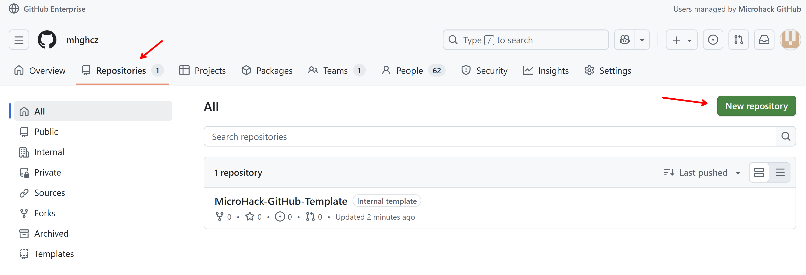
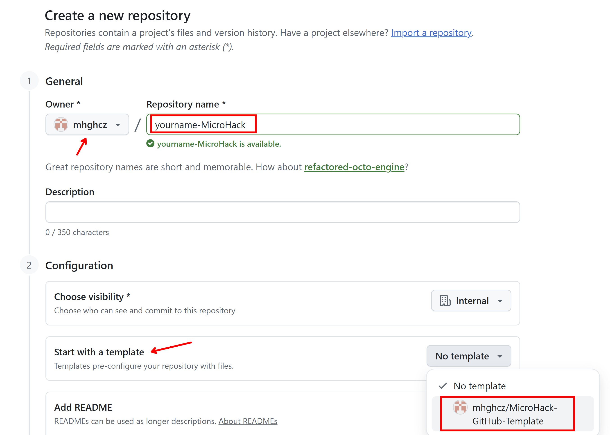

# Challenge 01: Access and Identity

## Overview

Ensure access to GitHub Organization. Discuss identity management options (Enterprise Managed Users vs. standard accounts, Azure AD federation).

## Learning Objectives

- Understand different GitHub identity management approaches
- Learn about Enterprise Managed Users vs standard GitHub accounts
- Explore federation options with Azure Active Directory
- Establish proper access controls and organization structure

## Prerequisites

- Basic understanding of identity and access management
- GitHub account (will be provided or configured during the challenge)
- Access to Azure Active Directory (if federation is explored)

## Tasks

### Task 1: GitHub Organization Access
1. Receive access to the designated GitHub Organization
2. Verify your permissions and role assignments
3. Explore the organization settings and structure

### Task 2: Identity Management Discussion
1. Learn about Enterprise Managed Users (EMU)
   - Benefits and limitations
   - When to use EMU vs standard accounts
2. Understand standard GitHub accounts integration
   - Personal vs organization accounts
   - Permission models

### Task 3: Azure AD Federation (Optional)
1. Explore SAML SSO configuration options
2. Understand the benefits of federated identity
3. Discuss implementation considerations

### Task 4: Create your own repository from MicroHack template
Create new repository and use your assigned name (eg. `user001-MicroHack`)

Start from template

## Success Criteria

- [ ] Successfully logged into GitHub Organization
- [ ] Can access organization repositories and settings
- [ ] Understand the differences between identity management approaches
- [ ] Know when to choose EMU vs standard accounts
- [ ] Create your MicroHack repository from template

## Additional Resources

- [GitHub Enterprise Managed Users documentation](https://docs.github.com/en/enterprise-cloud@latest/admin/identity-and-access-management/using-enterprise-managed-users-for-iam/about-enterprise-managed-users)
- [GitHub SAML SSO documentation](https://docs.github.com/en/enterprise-cloud@latest/admin/identity-and-access-management/using-saml-for-enterprise-iam)
- [Azure AD integration with GitHub](https://docs.microsoft.com/en-us/azure/active-directory/saas-apps/github-tutorial)

## Solution

[Solution Steps](/solutions/challenge-01/README.md)
