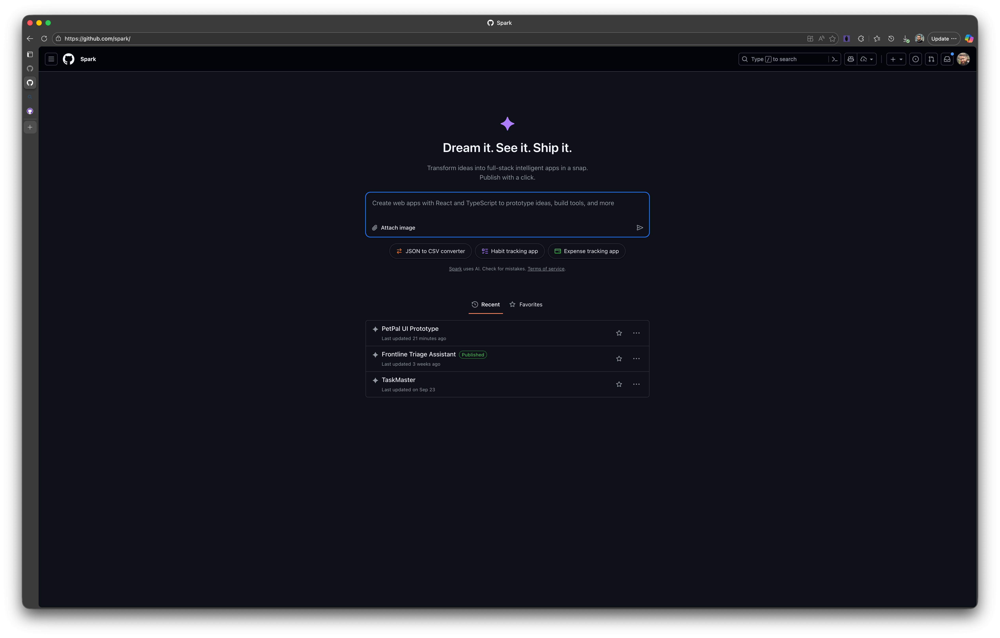
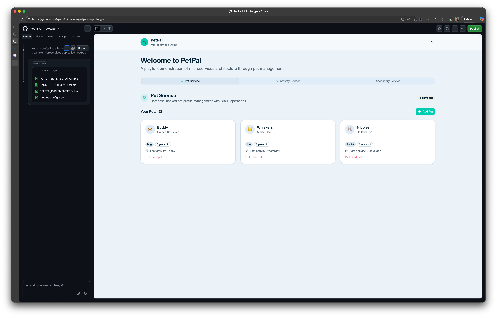

# Challenge 02 – GitHub Spark Introduction & Prototype Exercise

## 1. What is GitHub Spark (Quick Primer)
GitHub Spark lets you describe an app in natural language and quickly generate a full‑stack web application (frontend + backend services, data storage, auth, and optional AI features). You can iteratively refine using prompts, tweak code directly, or open a synced GitHub Codespace. One‑click deployment provisions managed infrastructure (Azure Container Apps + a small managed key‑value data store). Built‑in GitHub authentication, AI model integration, and repository syncing make it ideal for rapid ideation and teaching modern app lifecycles.

### Key Capabilities (Summarized)
- Natural language to working React/TypeScript app
- Automatic lightweight data store (Azure‑backed key/value)
- Built‑in GitHub auth & visibility controls
- Add AI features by prompting (e.g., summary, tagging)
- One‑click deploy to managed runtime
- Two‑way sync with a GitHub repository & Codespaces
- Collaboration via standard GitHub workflow (issues, PRs, Actions)

### When to Use Spark Here
For PetPal you need a fast, low‑friction prototype that shows UI integration points for three microservices (Pets, Activities, Accessories). Spark accelerates scaffolding so you can focus on domain modeling, UX, and collaboration patterns rather than initial boilerplate.

## 2. PetPal Context Recap
PetPal is a playful microservices demo app for managing virtual pets:
1. Pet Service – already implemented (CRUD, persistence).
2. Activity Service – tracks interactions/activities with pets.
3. Accessory Service – planned CRUD service (teams will implement later).

Your goal in this challenge: Produce a front‑end prototype (not production) that visually and structurally anticipates integrating all three services.

## 3. Challenge Objectives
Create (in GitHub Spark) an initial PetPal UI concept that:
1. Create a simple frontend-only web application with to our Pet Pal website.
2. Provides navigation affordances/placeholders for: Pets, Activities, Accessories.
3. Includes a view layout all pets (cards/list) with possibility of CRUD operations.
4. Anticipates asynchronous data loading (loading states / empty states).
5. Applies the specified brand & vibe guidelines (below).
6. Experiment with design, dark mode, and playful elements (subtle animations, emojis).

You do NOT need real API calls yet—stub data or mock functions are fine.

## 4. Acceptance Criteria
To consider the challenge complete:
- A Spark project (link or exported repo) exists with the above sections scaffolded.
- Visual design matches palette & tone (cards, subtle shadows, rounded corners).
- Dark mode toggle works OR a note is left describing how it will be added.
- Components are logically grouped; no giant single file.
- Clear placeholder comments where microservice data will be injected.
- README in the prototype includes: data flow diagram (can be textual), component list, integration plan for each service.
- No full Accessory Service logic—only placeholder UI & mock entries.

## 6. Hints / Recommendations for Github Spark
In the beginning, instead of one giant prompt, iterate:
1. Seed Prompt: Describe PetPal, the three microservices conceptually, brand palette, components you need, and dark mode requirement.
2. Refinement Prompt: Ask Spark to split into modular components with stubbed data providers for each service.
3. UI Polish Prompt: Request consistent spacing scale (e.g., 4/8/16/24), card hover, and responsive layout (mobile: single column pet list; desktop: grid of 3–4 columns).

### Prompt Crafting Tips
- Be explicit about component names you want to see generated.
- Mention “Use mock arrays; no external fetch yet” to prevent premature API wiring.
- If Spark over‑implements, ask it to simplify (“Reduce complexity; remove real network calls; keep pure React components.”)
- Use follow‑up prompts to extract a file/module list for documentation.

### What NOT to Do (Guardrails)
- Don’t implement real network calls yet.
- Don’t build full Accessory CRUD.
- Don’t introduce complex state libraries (Redux, Zustand) prematurely.
- Don’t remove brand colors or substitute an unrelated design system.

## 7. [OPTIONAL] Data & State (For Prototype Phase)
- Use local React state or a lightweight context for global theme & mock data.
- Keep mock data in separate modules (e.g., `mock/pets.ts`, `mock/activities.ts`).
- Mark all fake data with a leading comment: `// MOCK DATA: Replace with real service integration in Challenge X`.

## 8. [OPTIONAL] Stretch Ideas (Do NOT Required for Completion)
- Basic filtering (species, accessory count) – mock only.
- Simple activity aggregation widget (“Active pets today”).
- Skeleton loaders for initial view.
- Export a lightweight architectural diagram (draw.io / Mermaid in README).

**Don't open until after you finish the challenge iterations**

Help / Solution

View solution here: [Challenge 02 Solution](../../solutions/challenge-02/README.md)

## Next Step
Proceed to next challenge: [Challenge 03](../challenge-03/README.md)
