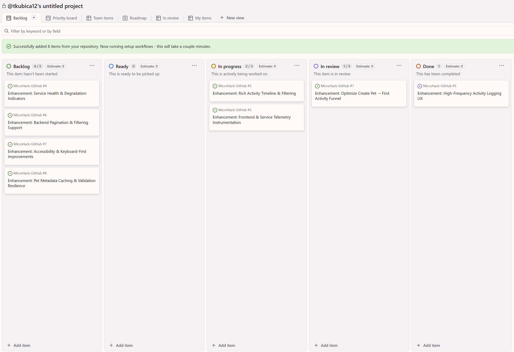

# Challenge 04: Brainstorming with AI, project management

## Overview
In this challenge we will work on roadmap for our product

## Create GitHub Copilot Spaces
We will create our **knowledge base** that spans multiple repositories and other sources.

Go to [https://github.com/copilot/spaces](https://github.com/copilot/spaces) and create new Space called `<yourname>-space`

- Add full repository `MicroHack-GitHub-engineering-constitution` 
- Add file `PRD.md` from `MicroHack-GitHub`.
- To demonstrate adding arbitrary files Upload file `context/pet-services-trends.md` that contains article about latest trends in industry

Add following custom instructions:

```markdown
You are product advisor for PetPal:

- Scope: Frontend + Pet & Activity services only
- Respect: Existing APIs, repo guidelines (AGENTS.md), current PRD
- Tasks: Generate feature ideas → user stories → acceptance criteria → high-level architecture → phased roadmap
- Style: Concise, assumption-aware, measurable outcomes, call out dependencies/risks
- Guardrails: No accessory/commerce features unless explicitly requested; align with existing data models
- Output: Actionable, traceable to PRD sections (Goals, Metrics, Scenarios)
```

## Brainstorm about new features
Directly in Spaces start new conversation using `GPT-5.1` model. Ask about suggestion for next features to implement into product. That specifically discuss adding new feature - accessories and how it might create new revenue streams.

Start with:

```markdown
What high‑impact opportunities (e.g., engagement, retention, monetization, operational efficiency) should be on our next 3–6 month roadmap, and what early signals or user pains justify exploring them?
```

Think about some of those ideas, we will come to them later.

Ask about accessories:

```markdown
What are the potential benefits (revenue streams, user stickiness, cross‑sell, data insights) and downsides (scope creep, inventory complexity, distraction from core pet/activity value) of introducing an accessories feature, and how could we mitigate the risks while validating demand quickly?
```

## Issues and planning
Now we have brainstormed ideas let's transform it into work items and project planning.

Go to your Codespaces and make sure GitHub MCP is configured and connected so you can ask Copilot to create Issues for you.

Ask Copilot to create few high level Issues you remember from your brainstorming session referencing our knowledge base. Here is example prompt:

```markdown
Create enhancement issues for following ideas. You may use context and previous discussions in `tomaskubica-space` Copilot Space to enhance description of that idea.

### Enhancement: Optimize Create Pet → First Activity Funnel
Streamline the journey (dashboard → create pet → log first activity) into a single, guided flow. Reduce clicks and form friction with inline creation and immediate activity prompt.

### Enhancement: Rich Activity Timeline & Filtering
Provide per-pet timeline with icons plus global filters (pet, type, date range) to speed retrieval. Improves engagement depth and reduces scrolling fatigue for staff users.

### Enhancement: Frontend & Service Telemetry Instrumentation
Add funnel and latency events (pet/activity create start/success/fail) with trace correlation. Enables measuring PRD success metrics and data-driven UX iteration.

### Enhancement: Service Health & Degradation Indicators
Implement robust `/health` checks and expose status to the frontend with clear banners. Allows graceful degradation when one service or Cosmos is impaired.

### Enhancement: High-Frequency Activity Logging UX
Introduce quick-add and duplicate-last shortcuts for recurring activities. Lowers effort for caretakers logging many entries daily, boosting cross-module usage.

### Enhancement: Backend Pagination & Filtering Support
Ensure Pet and Activity services provide server-side pagination, search, and filtered queries. Prevents over-fetching and keeps latency/RU consumption within targets.

### Enhancement: Accessibility & Keyboard-First Improvements
Audit and enhance forms, modals, and timelines for full keyboard and screen-reader support. Establish WCAG 2.1 AA compliance early to avoid costly retrofits.

### Enhancement: Pet Metadata Caching & Validation Resilience
Decouple Activity writes from synchronous Pet validation using cached or advisory checks. Mitigates cascading failures and maintains logging continuity during outages.
```

Open `Issues` in your GitHub.com repository and see what has been created. Click inside to see extra content Copilot has authored.

## Arrange issues within Project
Go to `Projects` in your GitHub.com repository, click `New project` and select for example `Kanban` template, confirm import of Open issues from your repo. 



## Create PRD for accessories functionality
After our brainstorming we have few ideas that we want to add into our Product Requirements Document, let's Copilot to help as merge it and formulate properly.

Example prompt:

```markdown
You have access to `tomaskubica-space` Copilot Space and to #PRD.md with our up-to-date product requirements. We have desided to add new `Accessories` capability into our product and your task is help formulate and merge requirements for this new service.

You can also search for relevant sections in repository #githubRepo CZSK-MicroHacks/MicroHack-GitHub-engineering-constitution

- Scope: Frontend + Pet, Activity, and new Accessory service
- Respect: Existing APIs and current `PRD.md`
- Tasks: Update `PRD.md` to introduce an `Accessories` capability as a first‑class product feature
- Style: Concise, assumption‑aware, measurable outcomes, clear user stories and scenarios
- Guardrails: This is a PRD only — do NOT add implementation details (no APIs, data schemas, database specifics, or code snippets). Focus on user value, user stories, flows, and success metrics.

Ntes:
- There will be separate Accessory Service with CRUD operations and search/filtering over accessories (type, low stock, pagination, etc.).
- Accessories include things like toys, food, collars, bedding, grooming, and other items, with stock and pricing.
- The service is intended to complement existing Pet and Activity services and eventually support monetization/engagement use cases.

Update `PRD.md` as follows:
1. Add an `Accessories` section (or extend an existing appropriate section) that:
   - Describes the high‑level problem and opportunity (e.g., new revenue streams, better engagement, cross‑sell with pet activities).
   - Defines primary user roles (e.g., caretakers, staff, admins) and what they want to achieve with accessories.
   - Includes several user stories in standard format (As a … I want … so that …) covering:
     - Browsing and searching accessories (by type, name, and low stock alerts).
     - Viewing accessory details (description, size, price, stock).
     - Maintaining the catalog (create/update/delete accessories).
     - Monitoring low stock items to trigger restocking actions.
     - (Optional) Early validation/experimentation stories, such as “soft launch” accessories with limited scope.
2. Extend or create PRD `Goals` / `Success Metrics` sections to include a few measurable outcomes related to accessories, e.g.:
   - % of active users who interact with accessories.
   - Catalog completeness/coverage per pet type.
   - Time to identify and resolve low‑stock situations.
3. Add 1–2 short `Scenarios` that tie accessories into existing Pet and Activity workflows (e.g., suggesting accessories related to certain activities or pet characteristics), but keep the description at business/experience level only.
4. Keep everything solution‑agnostic:
   - No mention of specific endpoints, models, Cosmos containers, schemas, or infra.
   - No technical diagrams or implementation notes.
   - If you need to refer to the backend, just say “Accessory service” or “backend services” in generic terms.

Patch current PRD.md file preserving existing structure and tone as much as possible and keep to the point and as brief as possible.
```


## Success Criteria

- [ ] GitHub Copilot Space `<yourname>-space` is created and configured with the `MicroHack-GitHub-engineering-constitution` repo, `PRD.md` file, and `context/pet-services-trends.md` upload.
- [ ] At least 3–5 meaningful enhancement issues are created in your repo, clearly derived from the Spaces brainstorming and linked to PRD goals/metrics where relevant.
- [ ] A GitHub Project (e.g., Kanban) is created, and the new enhancement issues are visible, triaged into appropriate columns, and roughly prioritized.
- [ ] `PRD.md` is updated to introduce the new `Accessories` capability with clear goals, user roles, user stories, success metrics, and at least 1–2 scenarios, staying solution‑agnostic.

**Don't open until after you finish the challenge iterations**
<details>

<summary>Help / Solution</summary>

View solution here: [Challenge 02 Solution](../../solutions/challenge-04/README.md)

</details>

## Next Step
Proceed to next challenge: [Challenge 05](../challenge-05/README.md)
