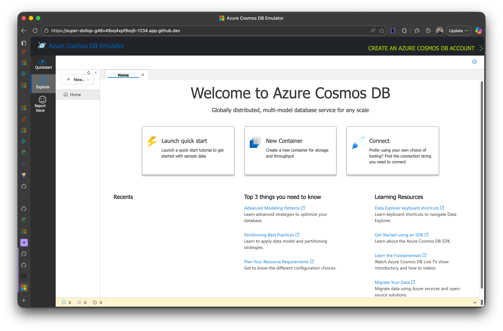
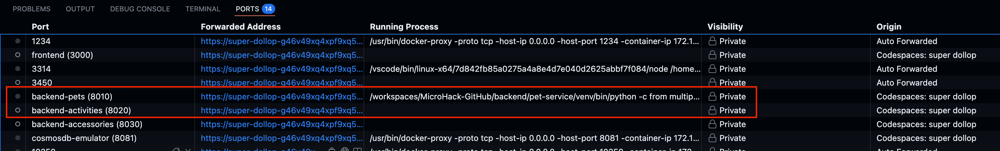

# Challenge 06: Design & Implement a New Microservice with Copilot

## Overview

In this challenge you move beyond incremental edits and practice an end‑to‑end design & build loop powered by GitHub Copilot. You will (a) set up the existing PetPal reference system, (b) design a new microservice using structured AI prompting, and (c) implement the service (the focus scenario: an `accessory-service`) using the design you iteratively refine with Copilot.

If you already have an `accessory-service` directory in your fork (e.g. from peeking at a solution branch), treat it as a reference only—don’t copy/paste wholesale. Re‑derive the design and implement it yourself to get the learning value.

> Prefer working in small, reviewable commits. Use Copilot to draft artifacts (OpenAPI spec, Pydantic models, tests) then refine manually. Lean on pull request discussion for validation.

---
## 0. Run the Existing PetPal Stack (Preparation)
Before designing a new service, spin up the current system so you understand integration points.

### 0.1 Cosmos DB Emulator (Docker)
```sh
docker pull mcr.microsoft.com/cosmosdb/linux/azure-cosmos-emulator:vnext-preview


docker run \
   --name cosmos-emulator \
   --detach \
   --publish 8081:8081 \
   --publish 1234:1234 \
   --publish 10250-10255:10250-10255 \
   mcr.microsoft.com/cosmosdb/linux/azure-cosmos-emulator:vnext-preview
```

> **⚠️ Important Note about SSL/TLS**: The Linux Cosmos DB emulator works more reliably with HTTP connections. The backend services are pre-configured to use `http://localhost:8081/` in their `.env` files. If you encounter SSL certificate errors, verify that `COSMOS_ENDPOINT=http://localhost:8081/` (not https) in the `.env` files for each service. See `/backend/COSMOS_EMULATOR_FIX.md` for details.

**Verify the emulator is running:**
If using GitHub Codespaces, access the forwarded port 1234 in your browser:
```
https://<your-codespace-name>-1234.app.github.dev/
```
Replace `<your-codespace-name>` with your actual Codespace name (e.g., `ideal-space-eureka-w5vxp9xrwphp9vw`). You should see the Cosmos DB Emulator explorer interface confirming the emulator is ready.

You should see the Cosmos DB Emulator explorer interface confirming the emulator is ready (no collections no data yet):



### 0.2 Start Backend Microservices
From repository root, ideally run in separate Terminals (icon of terminal with `+` in VS Code) icon looks like this:

> Important: make the auto-forwarded ports Public:
> 

Start the Pet Service backend:
```sh
cd backend/pet-service && ./start.sh
```


Start the Activity service backend:
```sh
cd backend/activity-service && ./start.sh
```

Ports (example):
* pet-service: 8010
* activity-service: 8020


### 0.4 Run UI (adjust backend URLs if using Codespaces)
Once the backend services are running, you can start the frontend (already prepared as docker image).

> Important: Replace the URLs for the backend services with generated URL from GH Codespaces:
> 


```sh
docker pull ghcr.io/michalmar/petpal-ui:latest

docker run -d \
   -p 3000:80 \
   -e VITE_API_PETS_URL=<pets service public URL> \
   -e VITE_API_ACTIVITIES_URL=<activities service public URL> \
   -e VITE_API_ACCESSORIES_URL=<accessories service public URL or placeholder> \
   -e VITE_API_GITHUB_TOKEN=$GITHUB_TOKEN \
   --name petpal-ui \
   ghcr.io/michalmar/petpal-ui:latest

docker run -d \
   -p 3000:80 \
   -e VITE_API_PETS_URL=https://super-dollop-g46v49xq4xpf9xq5-8010.app.github.dev \
   -e VITE_API_ACTIVITIES_URL=https://super-dollop-g46v49xq4xpf9xq5-8020.app.github.dev \
   -e VITE_API_ACCESSORIES_URL=https://super-dollop-g46v49xq4xpf9xq5-8030.app.github.dev \
   -e VITE_API_GITHUB_TOKEN=$GITHUB_TOKEN \
   --name petpal-ui \
   ghcr.io/michalmar/petpal-ui:latest
```


Open the forwarded port (3000). Confirm existing pets and activities load. Accessories will show empty or error until your service is implemented.

---
## 1. Challenge Focus
You will design and implement the `accessory-service` (or redesign it) that manages pet accessories (toys, collars, health devices). The service must expose CRUD + query endpoints, persist data (Cosmos DB emulator), and integrate with the UI and other services (potential future event flow: accessory purchased triggers activity log entry, etc.).

Key learning themes:
* Turning business requirements into a concrete OpenAPI spec.
* Iterative schema modeling (Pydantic + database documents) with Copilot feedback.
* Designing integration contracts & optional event messages.
* Authoring targeted tests before or alongside implementation.
* Using Copilot to propose but not blindly accept code.

---
## 2. High-Level Steps
1. Requirements elicitation (AI‑assisted user stories & constraints)
2. API surface drafting (OpenAPI YAML first)
3. Data & event schema design
4. Architecture & cross‑service integration strategy
5. Implementation plan (phased)
6. Incremental build (models -> persistence -> routes -> tests -> docs)
7. Validation, refinement, and performance/security review

The rest of this document expands these phases (merging with the original design tasks below). Original task numbering retained where feasible; new implementation tasks added.

---

## Learning Objectives

- Learn to use AI for architectural and design decisions
- Practice creating comprehensive technical specifications
- Understand microservices design patterns and best practices
- Experience collaborative design validation and iteration

## Prerequisites

- Understanding of microservices architecture
- Familiarity with the existing pet management system
- Completed previous Copilot challenges
- Basic knowledge of API design and data modeling

## Tasks

Below the original design tasks are augmented with concrete implementation subtasks for the accessory-service.

### Task 1: Requirements Analysis with AI
1. Use Copilot Chat to explore the business requirements for a new microservice
2. Analyze the existing system architecture to identify integration points
3. Generate user stories and use cases with AI assistance
4. Identify key functional and non-functional requirements

**Primary Target Microservice (for this challenge):**
* **Accessory Service**: Manage accessories that can be associated with pets (type, name, category, condition, acquisition date, price, tags, status). Support filtering (by pet, category, status) and future event emission (e.g., accessory_assigned, accessory_retired).

**Alternative Options (if you want to stretch):**
* Veterinary, Boarding, Training, Notification, Analytics (see prior list). If you pick a different service, adapt the implementation tasks accordingly.

Produce (store these in your notes or PR description):
* User stories (e.g., “As a pet owner I can list accessories assigned to a pet so I know what equipment is available”).
* Non‑functional requirements (latency < 300ms for list, predictable pagination, idempotent PUT, etc.).
* Risk/assumption list (e.g., accessories rarely exceed 1K per pet; soft delete vs hard delete; eventual consistency acceptable for derived analytics).

### Task 2: API Design and Specification
1. **RESTful API Design (Accessory Service)**:
   - Draft OpenAPI (YAML) first: endpoints (see suggested set below)
   - Iterate with Copilot: “Suggest pagination parameters for the accessories list endpoint.”
   - Endpoints (baseline):
     - `GET /health` (readiness/liveness)
     - `GET /accessories` (filters: `petId`, `category`, `status`, pagination cursor or offset+limit)
     - `POST /accessories` (create)
     - `GET /accessories/{id}`
     - `PUT /accessories/{id}` (full update, optimistic concurrency via ETag or `version` field)
     - `PATCH /accessories/{id}/status` (status transitions: active, lost, retired)
     - `DELETE /accessories/{id}` (soft delete recommended; include `deletedAt`)
     - `POST /accessories/{id}/assign` (associate with a pet)
   - Error model: consistent problem+json or `{ "error": { "code": "NOT_FOUND", "message": "..."}}`.
   - Auth: Document placeholder (e.g., future token verification) so spec is forward compatible.

2. **GraphQL Alternative** (optional):
   - Design GraphQL schema with AI assistance
   - Define queries, mutations, and subscriptions
   - Consider schema stitching with existing services

### Task 3: Data Schema Design
1. **Database (Cosmos DB / Document) Schema**:
    - Proposed document (partition by `petId` for pet‑scoped queries; if unassigned, partition by `accessoryId`):
       ```json
       {
          "id": "uuid",
          "petId": "uuid|null",
          "name": "string",
          "category": "TOY|HEALTH|WEARABLE|OTHER",
          "status": "ACTIVE|RETIRED|LOST",
          "condition": "NEW|GOOD|WORN|BROKEN",
          "acquiredAt": "ISO8601",
          "price": 12.50,
          "currency": "USD",
          "tags": ["durable","washable"],
          "version": 3,
          "deletedAt": null
       }
       ```
    - Indexing: partition key + category/status filtered fields; composite index if frequent category+status queries.
    - Migration: initial container create script + optional seed script.

2. **Event Schema (Optional but Recommended)**:
   - Events:
     - `accessory.assigned.v1` `{ accessoryId, petId, assignedAt }`
     - `accessory.status.changed.v1` `{ accessoryId, oldStatus, newStatus, changedAt }`
   - Strategy: include `type`, `version`, `occurredAt`, and unique event `id`.
   - Versioning: bump suffix (v2) when breaking changes occur; keep additive changes in same version with backward compatibility.

### Task 4: Technical Architecture
1. **Service Architecture (Recommended Layout)**:
   - `models.py` (Pydantic: AccessoryCreate, AccessoryRead, AccessoryUpdate, StatusPatch)
   - `database.py` (Cosmos client wrapper, repository functions)
   - `routes.py` or integrate in `main.py` (FastAPI routers)
   - `service.py` (business logic: validation, status transitions, version checks)
   - `events.py` (publisher abstraction; stub if not implemented yet)
   - `config.py` (env parsing, defaults)
   - Tests: `tests/test_accessories_api.py`, `tests/test_repository.py`
   - Logging: structured at INFO for lifecycle, DEBUG for queries.
   - Performance: batch reads for list; limit page size (default 25, max 100).
   - Resilience: retries (Cosmos transient failures) using exponential backoff.

2. **Integration Patterns**:
   - Synchronous: UI -> accessory-service REST; potential cross‑service calls (avoid unless necessary; prefer eventual events).
   - Asynchronous (future): publish events to a message broker (stub interface now so refactor is minimal later).
   - API Gateway: ensure paths/names consistent with existing services for unified routing.
   - Consistency: Source of truth is accessory document; denormalize limited metadata to activity logs via events.
   - Observability: Add `/health` + basic metrics hooks (placeholder).

### Task 5: Implementation Planning
1. **Development Phases (Suggested)**:
   - Phase 0: Spec draft (OpenAPI) + review.
   - Phase 1: Data models + repository + create/list endpoints (tests for these).
   - Phase 2: Detail endpoints (get/update/delete/status patch) + optimistic concurrency.
   - Phase 3: Assignment endpoint + event stubs.
   - Phase 4: Hardening (pagination, filters, validation, error responses).
   - Phase 5: Documentation polish + performance sanity tests.
   - Phase 6: Optional event publisher integration.
2. **DevOps Considerations**:
   - Container: mirror existing service Dockerfile pattern.
   - CI: lint, type check (if using mypy/ruff), run pytest; fail fast on coverage regression.
   - Deployment: align ports & environment variable naming conventions (`ACCESSORY_DB_ENDPOINT`, etc.).
   - Monitoring: log correlation ID (inject simple request ID middleware).

2. **DevOps Considerations**:
   - Design CI/CD pipeline requirements
   - Include containerization strategy
   - Specify monitoring and logging needs
   - Plan infrastructure requirements

### Task 6: Design & Implementation Validation and Refinement
1. **Peer Review**:
   - Present design to team members
   - Collect feedback and suggestions
   - Validate against existing architecture principles
   - Ensure compliance with organizational standards

2. **AI-Assisted Validation**:
   - Prompt examples:
     - “Suggest edge cases for accessory status transitions.”
     - “Review this OpenAPI snippet for missing error responses.”
     - “Propose pagination improvements for large accessory lists.”
   - Add or adjust tests per AI‑suggested gaps.

### Task 7 (New): Final Service Verification
1. Run all tests (existing + new) and capture results in PR description.
2. Manual UI check: accessories list populates after creating via API.
3. Confirm OpenAPI served at `/docs` responds with new endpoints.
4. (Optional) Latency sample: measure list endpoint under small load (e.g., 100 accessories).

## Success Criteria

- [ ] Comprehensive technical specification (requirements, API, data, events, architecture)
- [ ] OpenAPI spec committed (`accessory-service/openapi.yaml` or generated via FastAPI)
- [ ] CRUD + filter + status + assign endpoints implemented & tested
- [ ] Data model + partition strategy documented
- [ ] Tests passing (min: create/list/get/update/status/assign edge cases)
- [ ] Optional event schema documented (even if not emitted yet)
- [ ] Implementation plan tracked in PR (phase checkmarks)
- [ ] UI integration verified (accessories visible / creatable)
- [ ] Security & performance considerations documented
- [ ] Liveness/readiness endpoints operational

## Deliverables

### 1. Technical Design (Markdown or PR description section)
* Executive summary & context
* Functional + non‑functional requirements
* Architecture overview & component diagram (even ASCII acceptable)
* OpenAPI spec (YAML) or auto-generated FastAPI docs plus committed schema export
* Data & event schemas
* Integration patterns & contracts
* Security, resilience, performance notes

### 2. Implementation Plan
* Phases with status
* Risks & mitigations
* Test strategy (what is unit vs integration)
* Deployment & rollback notes
* Monitoring & logging approach

### 3. Code Artifacts
* `accessory-service/` source (models, routes, repository, config, tests)
* OpenAPI YAML export (if not checked in automatically)
* Sample HTTP requests (`accessory-service.http`)
* Seed or migration script (if needed to pre-populate examples)
* README for the service (run instructions, env vars, ports)

### 4. Validation Evidence
* Test run summary
* Manual UI screenshot or description
* Noted improvements from AI review

## Using Copilot Effectively for Design

### Prompting Strategies
```
"Design a RESTful API for a veterinary service that manages pet appointments, including scheduling, cancellation, and reminder notifications."

"Create a database schema for tracking pet health records, including vaccinations, medications, and medical history."

"Generate OpenAPI specification for a microservice that handles pet boarding reservations."
```

### Validation Prompts
```
"Review this API design for potential security vulnerabilities and suggest improvements."

"Analyze this database schema for performance bottlenecks and recommend optimizations."

"Identify potential integration challenges with existing microservices architecture."
```

## Additional Resources

- [Microservices design patterns](https://microservices.io/patterns/)
- [OpenAPI Specification](https://swagger.io/specification/)
- [API design best practices](https://docs.microsoft.com/en-us/azure/architecture/best-practices/api-design)
- [Database design principles](https://www.guru99.com/database-design.html)
- [Event-driven architecture patterns](https://docs.microsoft.com/en-us/azure/architecture/guide/architecture-styles/event-driven)

## Getting Help from Copilot (Quick Prompts)
Design:
```
Generate a FastAPI Pydantic model for an accessory with version field and enum status.
```
Testing:
```
Write a pytest test that creates an accessory then updates its status and asserts version increments.
```
Hardening:
```
Review this repository layer function for potential race conditions and propose a safer pattern.
```

## Solution

When you're ready to compare, review: [Solution Steps](/solutions/challenge-06/README.md)

> Resist jumping to the solution immediately—derive your own implementation first.