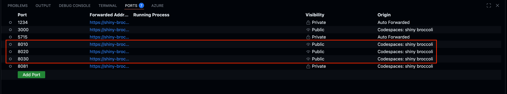
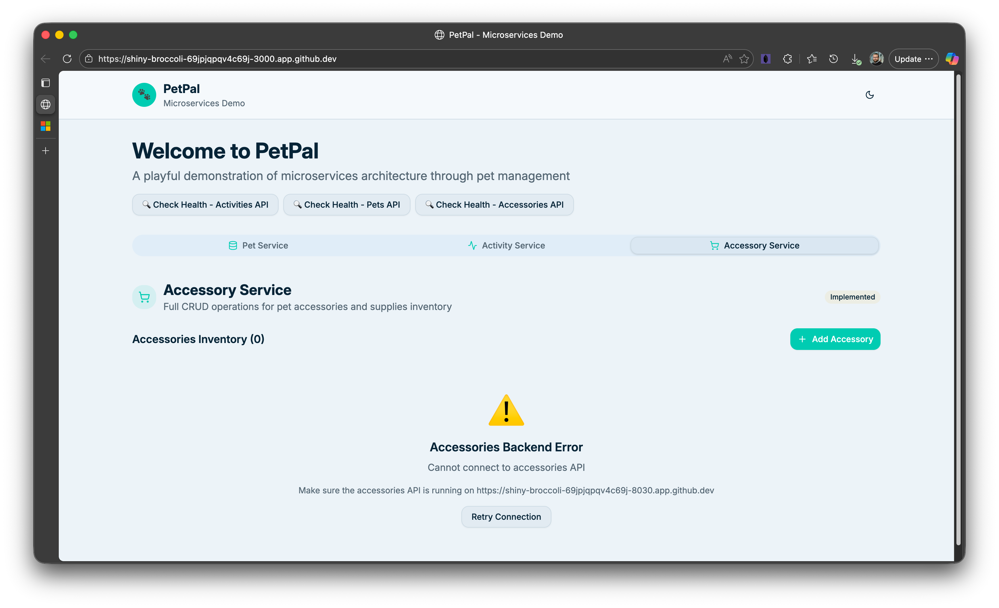

# Challenge 07: Implementation and testing

## Overview
In this challange we will implement and test our application - let's start with our two existing services and than code new one.

---
## 0. Run the Existing PetPal Stack (Preparation)
Before designing a new service, spin up the current system so you understand integration points.

### 0.1 Cosmos DB Emulator (Docker)
```sh
docker pull mcr.microsoft.com/cosmosdb/linux/azure-cosmos-emulator:vnext-preview

docker run \
   --name cosmos-emulator \
   --detach \
   --publish 8081:8081 \
   --publish 1234:1234 \
   mcr.microsoft.com/cosmosdb/linux/azure-cosmos-emulator:vnext-preview
```

> **⚠️ Important Note about SSL/TLS**: The Linux Cosmos DB emulator works more reliably with HTTP connections. The backend services are pre-configured to use `http://localhost:8081/` in their `.env` files. If you encounter SSL certificate errors, verify that `COSMOS_ENDPOINT=http://localhost:8081/` (not https) in the `.env` files for each service. See `/backend/COSMOS_EMULATOR_FIX.md` for details.

**Verify the emulator is running:**
If using GitHub Codespaces, access the forwarded port 1234 in your browser:
```
https://<your-codespace-name>-1234.app.github.dev/
```
Replace `<your-codespace-name>` with your actual Codespace name (e.g., `ideal-space-eureka-w5vxp9xrwphp9vw`). You should see the Cosmos DB Emulator explorer interface confirming the emulator is ready.

You should see the Cosmos DB Emulator explorer interface confirming the emulator is ready (no collections no data yet):


### 0.2 Start Backend Microservices
From repository root, ideally run in separate Terminals (icon of terminal with `+` in VS Code) icon looks like this:


Start the Pet Service backend:
```sh
cd backend/pet-service && ./start.sh
```


Start the Activity service backend:
```sh
cd backend/activity-service && ./start.sh
```

**Make the ports public**

You have started two backend services that will be used by the frontend UI:
* pet-service: 8010
* activity-service: 8020


Now check and make the auto-forwarded ports Public:

Option 1 - through GitHub Codespaces UI
- In GitHub Codespaces, go to the Ports tab (bottom panel), find the ports 8010 and 8020, and set their visibility to "Public" by righ-clicking on the port:


Option 2 - thtough script
```sh
./challenges/challenge-06/scripts/setup_ports.sh
```

In the end you should see the ports in Ports tab as Public:
 


### 0.3 Run UI Frontend
Once the backend services are running, you can start the frontend (already prepared as docker image).

> Note: The URLs for the backend services will be automatically generated using the CODESPACE_NAME environment variable.


```sh
docker pull ghcr.io/michalmar/petpal-ui:latest

docker run -d \
   -p 3000:80 \
   -e VITE_API_PETS_URL=https://${CODESPACE_NAME}-8010.app.github.dev \
   -e VITE_API_ACTIVITIES_URL=https://${CODESPACE_NAME}-8020.app.github.dev \
   -e VITE_API_ACCESSORIES_URL=https://${CODESPACE_NAME}-8030.app.github.dev \
   -e VITE_API_GITHUB_TOKEN=$GITHUB_TOKEN \
   --name petpal-ui \
   ghcr.io/michalmar/petpal-ui:latest

```

Open the forwarded port (3000) - Go to Codespaces' Ports tab and click on the Globe icon. An you should see something similar to:

> Note: for the first time it also creates and do initial load of data to the Cosmos DB, so it might take few seconds to load.


Confirm existing pets and activities load. Accessories will show empty or error until your service is implemented.

### 0.4 Challenge check

The implemented frontend should show existing pets and activities. But accessories will be empty as the service is not implemented yet, in fact you can see Backend Error in the browser console:


This is intentional as the accessory-service is not implemented yet. You are now ready to design and implement it in the next steps.


## 1. Challenge Focus

In this challenge, you will implement the **Accessory Service** - a microservice that manages pet accessories (toys, food, collars, bedding, grooming supplies, etc.). The service exposes REST API endpoints for CRUD operations with advanced filtering and search capabilities, persists data in Azure Cosmos DB (using the emulator), and integrates with the existing PetPal ecosystem.

**What You'll Build:**
- RESTful API with FastAPI following the existing service patterns
- Pydantic models for data validation (matching the provided schema)
- Cosmos DB integration with lazy initialization
- Search and filtering capabilities (by type, stock level, name)
- Pagination support for list operations
- Proper error handling and logging

**Key Learning Objectives:**
* Use GitHub Copilot to implement a complete microservice following established patterns
* Design and implement Pydantic models from specifications
* Work with Azure Cosmos DB (document database) using Python SDK
* Create RESTful endpoints with proper HTTP semantics
* Implement search and filtering logic
* Test API endpoints using HTTP client files
* Follow consistent coding patterns across microservices

## 2. First implementation
We have technical specifications pretty detailed so we can ask Copilot agent to code our accessory service based on it. Then we will test and iterate.

Try this prompt and make sure all our context is available to Copilot (drag our specs files into chat context).

```markdown
Your task is to code new microservice accessory-service based on specification.

1. Closely follow all technical specifications in `specs/services/accessory-service`, make sure to read all files there before continuing.
2. Review code, .env, start script and other parts our existing services `backend/activity-service` and `backend/pet-service` to make sure we follow the same style and structure.
3. If you need overall architecture overview read documents in `specs/platform` and for business requirements you can check `PRD.md`
4. After you gather all mention documents think about solution and plan for execution
5. Once you have plan what to do, start implementing this
6. Read types of tests in `backend/accessory-service/accessory-service.http` and write simple testing script that will do something similar. In one terminal run service, in other run test script and iterate until everything is OK.
```

Open `backend/accessory-service/accessory-service.http` which contains few API tests. Run throw them all, must be OK with no errors and make sense (eg. search returns correct items). If there are errors or unexpected behavior, work with Copilot to fix it.

### Example issues
For example if tests show you can write, but **getting accessories return empty array**, most likely there is error in how code builds WHERE filters in SQL query. Point this out to Copilot, for example:

```markdown
Accessory services correctly write items, but search and filter do not work, empty array is returned. Review the way how filters are build, write simple test Python script that uses the same .env and iterate over it until you find correct implementation and than fix our accessory service code.
```

Creating accessory fails with validation error such as

```json
HTTP/1.1 400 Bad Request
date: Wed, 19 Nov 2025 11:11:57 GMT
server: uvicorn
content-length: 793
content-type: application/json
connection: close

{
  "detail": "5 validation errors for Accessory\nname\n  Field required [type=missing, input_value={}, input_type=dict]\n    For further information visit https://errors.pydantic.dev/2.5/v/missing\ntype\n  Field required [type=missing, input_value={}, input_type=dict]\n    For further information visit https://errors.pydantic.dev/2.5/v/missing\nprice\n  Field required [type=missing, input_value={}, input_type=dict]\n    For further information visit https://errors.pydantic.dev/2.5/v/missing\nstock\n  Field required [type=missing, input_value={}, input_type=dict]\n    For further information visit https://errors.pydantic.dev/2.5/v/missing\nsize\n  Field required [type=missing, input_value={}, input_type=dict]\n    For further information visit https://errors.pydantic.dev/2.5/v/missing"
}
```

Copy this error to Copilot and let it find solution.

## 3. Seed data for accessories
Let's generate some seed data, ask Copilot to simply create Python script to do that.

```markdown
See API structure in `specs/services/accessory-service/API_REFERENCE.md` and create two scripts:
- delete_accessories: This script will delete all accessories
- seed_accessories: This script will create 3 example accessories (two toys, one food item with low stock)
```

## Success criteria

- [ ] Accessory service is running and accessible on port 8030
- [ ] All endpoints defined in the API specification are implemented and functional
- [ ] Data is correctly persisted to Azure Cosmos DB Emulator
- [ ] Search and filtering functionality works as expected
- [ ] The frontend UI displays accessories correctly without errors 


