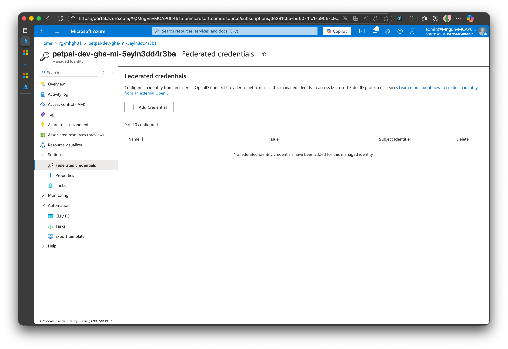
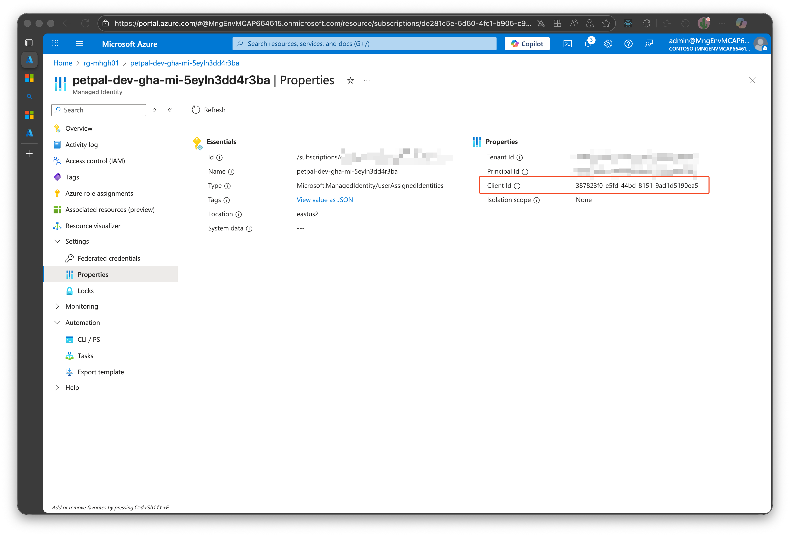

# Challenge 09: Deployment Automation using GitHub Actions

## Overview

Build a complete CI/CD pipeline for the PetPal microservices application using GitHub Actions. You'll start with simple container deployments and progressively add sophisticated features like automated testing, multi-environment deployments, and quality gates.

## Learning Objectives

- Implement CI/CD pipelines for containerized microservices
- Learn GitHub Actions best practices and Azure Container Apps deployment
- Master Docker image building, tagging, and registry management
- Understand deployment strategies and environment promotion
- Experience with automated testing and quality gates

## Prerequisites

- Completed Challenge 08 (Infrastructure as Code deployed via `azd provision`)
- **Azure Container Registry (ACR) created in Challenge 08**
- GitHub repository with write permissions
- Azure Container Apps environment running (from Challenge 08)
- Understanding of Docker, GitHub Actions, and CI/CD concepts

**Required Information from Challenge 08:**
- ACR login server and registry name (e.g., `petpal12345.azurecr.io`, `petpalacr12345`)
- GitHub managed identity client ID (`githubManagedIdentityClientId` output)
- Azure tenant ID and subscription ID
- Resource group name
- Container App names for all services

## Architecture Context

Your PetPal application consists of:

**Backend Services (Python FastAPI):**
- **Pet Service** - Port 8010, manages pet data
- **Activity Service** - Port 8020, tracks pet activities  
- **Accessory Service** - Port 8030, manages pet accessories

**Frontend:**
- **React UI** - Port 80, connects to all backend services

**Infrastructure (Azure):**
- **Azure Container Apps Environment** with Log Analytics
- **Azure Cosmos DB** (serverless) for data persistence
- **4 Container Apps** (one per service)

Each service has its own Dockerfile and runs independently in Azure Container Apps.

## Progressive Implementation Strategy

This challenge uses a **progressive complexity approach**:

1. **Phase 1 (Tasks 1-2)**: Get basic deployments working for all services
2. **Phase 2 (Tasks 3-5)**: Add testing, quality gates, and environment management
3. **Phase 3 (Tasks 6-7)**: Implement advanced features and monitoring

Start simple, validate each phase works, then add complexity.

---

## Tasks

### Task 1: Setup and Single Service Deployment

**Goal**: Deploy the Pet Service automatically with GitHub Actions.

<!-- ```bash
# Get Container App name from azd deployment
PET_SERVICE_NAME=$(az containerapp list --resource-group $RESOURCE_GROUP --query "[?contains(name, 'pet-service')].name" -o tsv)
# Get the service URL
PET_SERVICE_URL=$(az containerapp show --name $PET_SERVICE_NAME --resource-group $RESOURCE_GROUP --query properties.configuration.ingress.fqdn -o tsv)
echo "Pet Service URL: https://$PET_SERVICE_URL"

# Test the service
curl https://$PET_SERVICE_URL/health
``` -->

#### 1.1 Configure GitHub Federated Identity

Before creating workflows, grant GitHub Actions access to Azure using the managed identity provisioned in Challenge 08.

Go to **Azure Portal → Managed Identities → [Your Identity] → Federated Identity Credentials**:



Setup the federated credential with your repo:


Get the **Client ID** from the identity overview page.



```
repo:<owner>/<repo>
```

1. **Retrieve identity metadata and ACR details**

  ```bash
  REPO_FULL=$(gh repo view --json nameWithOwner -q .nameWithOwner)

  # Get resource group from azd environment
  RESOURCE_GROUP=$(azd env get-value AZURE_RESOURCE_GROUP)

  # Get Azure identity information
  AZURE_CLIENT_ID=$(az identity list --resource-group $RESOURCE_GROUP --query "[?contains(name, '-gha-mi-')].clientId" -o tsv)

  AZURE_TENANT_ID=$(az account show --query tenantId -o tsv)
  AZURE_SUBSCRIPTION_ID=$(az account show --query id -o tsv)

  # Get Azure Container Registry details
  ACR_NAME=$(az acr list --resource-group $RESOURCE_GROUP --query "[0].name" -o tsv)
  ACR_LOGIN_SERVER=$(az acr list --resource-group $RESOURCE_GROUP --query "[0].loginServer" -o tsv)

  echo "Repository: $REPO_FULL"
  echo "RESOURCE_GROUP=$RESOURCE_GROUP"
  echo "AZURE_CLIENT_ID=$AZURE_CLIENT_ID"
  echo "AZURE_TENANT_ID=$AZURE_TENANT_ID"
  echo "AZURE_SUBSCRIPTION_ID=$AZURE_SUBSCRIPTION_ID"
  echo "ACR_NAME=$ACR_NAME"
  echo "ACR_LOGIN_SERVER=$ACR_LOGIN_SERVER"
  ```

2. **Store GitHub secrets** (requires `repo` + `workflow` scopes on the GitHub CLI authentication):


  ```bash
  gh secret set AZURE_CLIENT_ID --body "$AZURE_CLIENT_ID" --repo "$REPO_FULL"
  gh secret set AZURE_TENANT_ID --body "$AZURE_TENANT_ID" --repo "$REPO_FULL"
  gh secret set AZURE_SUBSCRIPTION_ID --body "$AZURE_SUBSCRIPTION_ID" --repo "$REPO_FULL"
  ```
> Note: if you see 403 errors, ensure your GitHub CLI authentication has the required scopes. example error message: `failed to fetch public key: HTTP 403: Resource not accessible by integration `
> 
> How to setup GitHub CLI authentication with proper scopes:
> - Run `gh auth login --scopes "repo,workflow"`
> - or refresh using `gh auth refresh --scopes "repo,workflow"`


3. **Store GitHub variables** for common values:

  ```bash
  gh variable set RESOURCE_GROUP --body "$RESOURCE_GROUP" --repo "$REPO_FULL"
  gh variable set ACR_NAME --body "$ACR_NAME" --repo "$REPO_FULL"
  gh variable set ACR_LOGIN_SERVER --body "$ACR_LOGIN_SERVER" --repo "$REPO_FULL"
  ```

4. **Verify federated credential subject** (optional):

  ```bash
  az identity federated-credential list \
    --identity-name $(az identity list --resource-group $RESOURCE_GROUP --query "[?contains(name, '-gha-mi-')].name" -o tsv) \
    --resource-group $RESOURCE_GROUP \
    --query "[].subject"
  ```

  Ensure the output contains `repo:<owner>/<repo>:ref:refs/heads/main` (or the branch/environment you'll deploy from). Update the Challenge 08 parameters if you need additional subjects.

#### 1.4 Create First GitHub Actions Workflow

Create `.github/workflows/deploy-pet-service.yml`:

```yaml
name: Deploy Pet Service

on:
  push:
    branches: [main]
    paths:
      - 'backend/pet-service/**'
      - '.github/workflows/deploy-pet-service.yml'
  workflow_dispatch:

permissions:
  id-token: write
  contents: read

env:
  SERVICE_NAME: petpal-pet-service
  SERVICE_PATH: backend/pet-service
  COSMOS_DATABASE_NAME: petservice
  COSMOS_CONTAINER_NAME: pets
  RESOURCE_GROUP: ${{ vars.RESOURCE_GROUP }}
  ACR_NAME: ${{ vars.ACR_NAME }}
  ACR_LOGIN_SERVER: ${{ secrets.ACR_LOGIN_SERVER }}

jobs:
  build-and-deploy:
    runs-on: ubuntu-latest

    steps:
      - name: Checkout code
        uses: actions/checkout@v4

      - name: Azure login (federated managed identity)
        uses: azure/login@v2
        with:
          auth-type: ID_TOKEN
          client-id: ${{ secrets.AZURE_CLIENT_ID }}
          tenant-id: ${{ secrets.AZURE_TENANT_ID }}
          subscription-id: ${{ secrets.AZURE_SUBSCRIPTION_ID }}

      - name: Authenticate Docker with ACR
        run: az acr login --name "$ACR_NAME" --output none

      - name: Set up Docker Buildx
        uses: docker/setup-buildx-action@v3

      - name: Build and push image
        uses: docker/build-push-action@v5
        with:
          context: ./${{ env.SERVICE_PATH }}
          push: true
          tags: |
            ${{ env.ACR_LOGIN_SERVER }}/${{ env.SERVICE_NAME }}:${{ github.sha }}
            ${{ env.ACR_LOGIN_SERVER }}/${{ env.SERVICE_NAME }}:latest
          cache-from: type=gha
          cache-to: type=gha,mode=max

      - name: Get Cosmos DB credentials
        id: cosmos
        run: |
          COSMOS_ACCOUNT=$(az cosmosdb list --resource-group "$RESOURCE_GROUP" --query "[0].name" -o tsv)
          COSMOS_ENDPOINT=$(az cosmosdb show --resource-group "$RESOURCE_GROUP" --name "$COSMOS_ACCOUNT" --query documentEndpoint -o tsv)
          COSMOS_KEY=$(az cosmosdb keys list --resource-group "$RESOURCE_GROUP" --name "$COSMOS_ACCOUNT" --type keys --query primaryMasterKey -o tsv)

          echo "endpoint=$COSMOS_ENDPOINT" >> "$GITHUB_OUTPUT"
          echo "::add-mask::$COSMOS_KEY"
          echo "key=$COSMOS_KEY" >> "$GITHUB_OUTPUT"

      - name: Deploy to Container App
        run: |
          APP_NAME=$(az containerapp list --resource-group "$RESOURCE_GROUP" --query "[?contains(name, 'pet-service')].name" -o tsv)

          az containerapp update \
            --name "$APP_NAME" \
            --resource-group "$RESOURCE_GROUP" \
            --image "$ACR_LOGIN_SERVER/${{ env.SERVICE_NAME }}:${{ github.sha }}" \
            --set-env-vars \
              COSMOS_ENDPOINT=${{ steps.cosmos.outputs.endpoint }} \
              COSMOS_DATABASE_NAME=${{ env.COSMOS_DATABASE_NAME }} \
              COSMOS_CONTAINER_NAME=${{ env.COSMOS_CONTAINER_NAME }} \
            --secrets \
              cosmos-key=${{ steps.cosmos.outputs.key }} \
            --replace-env-vars \
              COSMOS_KEY=secretref:cosmos-key
```

**Required GitHub Secrets:**
- `AZURE_CLIENT_ID` - Managed identity client ID from Challenge 08 outputs
- `AZURE_TENANT_ID` - Azure tenant ID
- `AZURE_SUBSCRIPTION_ID` - Azure subscription ID

**Required GitHub Variables:**
- `RESOURCE_GROUP` - Azure resource group name
- `ACR_NAME` - Azure Container Registry name
- `ACR_LOGIN_SERVER` - Azure Container Registry login server

Use the commands in **Step 1.3** to configure these secrets and variables. If you prefer the GitHub UI, add the same entries manually via **Settings → Secrets and variables → Actions**.

> **Heads-up**: Later sample workflows in this challenge previously referenced service principals and registry passwords. When following the managed identity path, reuse the `azure/login` configuration above (`auth-type: ID_TOKEN`) and rely on `az acr login` instead of `docker/login-action` with static credentials.
```

**📝 Task 1 Deliverables:**
- [ ] ACR verified and accessible (from Challenge 08)
- [ ] GitHub workload identity secrets/variables configured
- [ ] Pet Service Docker image built and pushed manually
- [ ] Pet Service Container App updated with custom image
- [ ] GitHub Actions workflow created and successfully deployed Pet Service
- [ ] Service accessible via HTTPS endpoint

---

### Task 2: Deploy All Microservices

**Goal**: Create deployment workflows for all three backend services and the frontend.

#### 2.1 Verify Existing Dockerfiles

All services already have Dockerfiles in their respective directories:
- `backend/pet-service/Dockerfile` ✓
- `backend/activity-service/Dockerfile` (verify/create if missing)
- `backend/accessory-service/Dockerfile` (verify/create if missing)
- Frontend Dockerfile location (verify in frontend directory)

**If any Dockerfiles are missing**, copy and adapt from the Pet Service:

```bash
# Only if needed - Activity Service
cp backend/pet-service/Dockerfile backend/activity-service/Dockerfile
# Edit: Change port from 8010 to 8020, adjust user/service name

# Only if needed - Accessory Service  
cp backend/pet-service/Dockerfile backend/accessory-service/Dockerfile
# Edit: Change port from 8010 to 8030, adjust user/service name
```

#### 2.2 Create Workflow for Each Backend Service

Create workflows following the Pet Service pattern. Each backend service needs:
- **Cosmos DB connection** (endpoint, key, database name, container name)
- **Service-specific port** (8010, 8020, 8030)
- **Unique image name** and Container App name

**Create `.github/workflows/deploy-activity-service.yml`:**

```yaml
name: Deploy Activity Service

on:
  push:
    branches: [main]
    paths:
      - 'backend/activity-service/**'
      - '.github/workflows/deploy-activity-service.yml'
  workflow_dispatch:

env:
  SERVICE_NAME: petpal-activity-service
  SERVICE_PATH: backend/activity-service
  COSMOS_DATABASE_NAME: activityservice
  COSMOS_CONTAINER_NAME: activities

jobs:
  build-and-deploy:
    runs-on: ubuntu-latest
    
    steps:
      - name: Checkout code
        uses: actions/checkout@v4
      
      - name: Set up Docker Buildx
        uses: docker/setup-buildx-action@v3
      
      - name: Log in to Azure Container Registry
        uses: docker/login-action@v3
        with:
          registry: ${{ secrets.ACR_LOGIN_SERVER }}
          username: ${{ secrets.ACR_USERNAME }}
          password: ${{ secrets.ACR_PASSWORD }}
      
      - name: Build and push image
        uses: docker/build-push-action@v5
        with:
          context: ./${{ env.SERVICE_PATH }}
          push: true
          tags: |
            ${{ secrets.ACR_LOGIN_SERVER }}/${{ env.SERVICE_NAME }}:${{ github.sha }}
            ${{ secrets.ACR_LOGIN_SERVER }}/${{ env.SERVICE_NAME }}:latest
          cache-from: type=gha
          cache-to: type=gha,mode=max
      
      - name: Azure Login
        uses: azure/login@v2
        with:
          creds: ${{ secrets.AZURE_CREDENTIALS }}
      
      - name: Get Cosmos DB credentials
        id: cosmos
        run: |
          COSMOS_ENDPOINT=$(az cosmosdb list --resource-group ${{ vars.RESOURCE_GROUP }} --query "[0].documentEndpoint" -o tsv)
          COSMOS_KEY=$(az cosmosdb keys list \
            --resource-group ${{ vars.RESOURCE_GROUP }} \
            --name $(az cosmosdb list --resource-group ${{ vars.RESOURCE_GROUP }} --query "[0].name" -o tsv) \
            --type keys --query primaryMasterKey -o tsv)
          
          echo "endpoint=$COSMOS_ENDPOINT" >> $GITHUB_OUTPUT
          echo "::add-mask::$COSMOS_KEY"
          echo "key=$COSMOS_KEY" >> $GITHUB_OUTPUT
      
      - name: Deploy to Container App
        run: |
          APP_NAME=$(az containerapp list --resource-group ${{ vars.RESOURCE_GROUP }} --query "[?contains(name, 'activity-service')].name" -o tsv)
          
          az containerapp update \
            --name $APP_NAME \
            --resource-group ${{ vars.RESOURCE_GROUP }} \
            --image ${{ secrets.ACR_LOGIN_SERVER }}/${{ env.SERVICE_NAME }}:${{ github.sha }} \
            --set-env-vars \
              COSMOS_ENDPOINT=${{ steps.cosmos.outputs.endpoint }} \
              COSMOS_DATABASE_NAME=${{ env.COSMOS_DATABASE_NAME }} \
              COSMOS_CONTAINER_NAME=${{ env.COSMOS_CONTAINER_NAME }} \
            --secrets \
              cosmos-key=${{ steps.cosmos.outputs.key }} \
            --replace-env-vars \
              COSMOS_KEY=secretref:cosmos-key
```

**Create `.github/workflows/deploy-accessory-service.yml`:**

Same structure as Activity Service, but change:
- `SERVICE_NAME: petpal-accessory-service`
- `SERVICE_PATH: backend/accessory-service`
- `COSMOS_DATABASE_NAME: accessoryservice`
- `COSMOS_CONTAINER_NAME: accessories`
- App name query: `[?contains(name, 'accessory-service')]`

**Pro Tip**: Use GitHub Copilot to generate:
```
@workspace Create a GitHub Actions workflow for deploying the Accessory Service to Azure Container Apps. 
Follow the same pattern as deploy-activity-service.yml but adjust for:
- Service location: backend/accessory-service
- Image name: petpal-accessory-service
- Database: accessoryservice
- Container: accessories
```

#### 2.3 Frontend Deployment Considerations

The frontend requires backend service URLs as environment variables:

```yaml
# In deploy-frontend.yml, after Azure login:
- name: Get backend service URLs
  id: get-urls
  run: |
    PET_URL=$(az containerapp show --name <pet-service-name> --resource-group ${{ env.RESOURCE_GROUP }} --query properties.configuration.ingress.fqdn -o tsv)
    ACTIVITY_URL=$(az containerapp show --name <activity-service-name> --resource-group ${{ env.RESOURCE_GROUP }} --query properties.configuration.ingress.fqdn -o tsv)
    ACCESSORY_URL=$(az containerapp show --name <accessory-service-name> --resource-group ${{ env.RESOURCE_GROUP }} --query properties.configuration.ingress.fqdn -o tsv)
    
    echo "pet_url=https://$PET_URL" >> $GITHUB_OUTPUT
    echo "activity_url=https://$ACTIVITY_URL" >> $GITHUB_OUTPUT
    echo "accessory_url=https://$ACCESSORY_URL" >> $GITHUB_OUTPUT

      - name: Deploy to Container App
        uses: azure/container-apps-deploy-action@v1
        with:
          containerAppName: ${{ env.AZURE_CONTAINER_APP_NAME }}
          resourceGroup: ${{ env.RESOURCE_GROUP }}
          imageToDeploy: ${{ secrets.ACR_LOGIN_SERVER }}/petpal-frontend:${{ github.sha }}
          environmentVariables: |
            VITE_API_PETS_URL=${{ steps.get-urls.outputs.pet_url }}
            VITE_API_ACTIVITIES_URL=${{ steps.get-urls.outputs.activity_url }}
            VITE_API_ACCESSORIES_URL=${{ steps.get-urls.outputs.accessory_url }}
```

**📝 Task 2 Deliverables:**
- [ ] All services have Dockerfiles (verify existing, create if missing)
- [ ] GitHub Actions workflows for all four services (pet, activity, accessory, frontend)
- [ ] All workflows include proper Cosmos DB environment variables and secrets
- [ ] All workflows successfully deploy on push to main
- [ ] All services accessible and functional
- [ ] Frontend connects to all backend services correctly---

### Task 3: Add Automated Testing

**Goal**: Implement automated testing in the CI pipeline before deployment.

#### 3.1 Setup Python Testing for Backend Services

Each Python service should have unit tests. Create test files:

```python
# backend/pet-service/test_api.py
import pytest
from fastapi.testclient import TestClient
from main import app

client = TestClient(app)

def test_root():
    response = client.get("/")
    assert response.status_code == 200
    assert "Pet Service" in response.json()["message"]

def test_health():
    response = client.get("/health")
    assert response.status_code in [200, 503]  # 503 if CosmosDB not configured
```

#### 3.2 Add Testing Stage to Workflows

Update each backend service workflow to include testing:

```yaml
jobs:
  test:
    runs-on: ubuntu-latest
    steps:
      - name: Checkout code
        uses: actions/checkout@v4
      
      - name: Set up Python
        uses: actions/setup-python@v5
        with:
          python-version: '3.11'
      
      - name: Install dependencies
        working-directory: ./backend/pet-service
        run: |
          pip install -r requirements.txt
          pip install pytest pytest-cov httpx
      
      - name: Run tests
        working-directory: ./backend/pet-service
        run: |
          pytest --cov=. --cov-report=xml --cov-report=term
      
      - name: Upload coverage
        uses: codecov/codecov-action@v3
        with:
          files: ./backend/pet-service/coverage.xml
          flags: pet-service
  
  build-and-deploy:
    needs: test  # Only deploy if tests pass
    runs-on: ubuntu-latest
    # ... rest of build/deploy job
```

#### 3.3 Add Linting and Code Quality

```yaml
- name: Lint with flake8
  working-directory: ./backend/pet-service
  run: |
    pip install flake8
    flake8 . --count --select=E9,F63,F7,F82 --show-source --statistics
    flake8 . --count --max-complexity=10 --max-line-length=127 --statistics
```

#### 3.4 Container Security Scanning

```yaml
- name: Run Trivy vulnerability scanner
  uses: aquasecurity/trivy-action@master
  with:
    image-ref: ${{ env.REGISTRY }}/${{ env.IMAGE_NAME }}:${{ github.sha }}
    format: 'sarif'
    output: 'trivy-results.sarif'

- name: Upload Trivy results to GitHub Security
  uses: github/codeql-action/upload-sarif@v3
  with:
    sarif_file: 'trivy-results.sarif'
```

**📝 Task 3 Deliverables:**
- [ ] Unit tests created for all backend services
- [ ] Test job added to all workflow files
- [ ] Deployment only proceeds if tests pass
- [ ] Code coverage reporting integrated
- [ ] Linting checks added to workflows
- [ ] Container vulnerability scanning implemented

---

### Task 4: Implement Environment Management

**Goal**: Support multiple environments (dev, staging, production) with proper isolation.

#### 4.1 Setup Environment-Specific Configuration

GitHub offers environment protection rules. Create environments:

1. Go to Repository Settings → Environments
2. Create three environments: `dev`, `staging`, `production`
3. Configure protection rules:
   - **dev**: No restrictions
   - **staging**: Require 1 reviewer
   - **production**: Require 2 reviewers + wait timer (5 min)

#### 4.2 Multi-Environment Workflow Pattern

Refactor workflows to support environment selection:

```yaml
name: Deploy Pet Service - Multi-Environment

on:
  push:
    branches: [main, develop]
    paths: ['backend/pet-service/**']
  workflow_dispatch:
    inputs:
      environment:
        description: 'Environment to deploy'
        required: true
        type: choice
        options:
          - dev
          - staging
          - production

jobs:
  determine-environment:
    runs-on: ubuntu-latest
    outputs:
      environment: ${{ steps.set-env.outputs.environment }}
    steps:
      - name: Determine environment
        id: set-env
        run: |
          if [ "${{ github.event_name }}" == "workflow_dispatch" ]; then
            echo "environment=${{ inputs.environment }}" >> $GITHUB_OUTPUT
          elif [ "${{ github.ref }}" == "refs/heads/main" ]; then
            echo "environment=dev" >> $GITHUB_OUTPUT
          elif [ "${{ github.ref }}" == "refs/heads/develop" ]; then
            echo "environment=dev" >> $GITHUB_OUTPUT
          fi
  
  test:
    runs-on: ubuntu-latest
    # ... test job
  
  deploy:
    needs: [determine-environment, test]
    runs-on: ubuntu-latest
    environment: ${{ needs.determine-environment.outputs.environment }}
    
    steps:
      - name: Deploy to ${{ needs.determine-environment.outputs.environment }}
        # Use environment-specific variables:
        # ${{ secrets.AZURE_CREDENTIALS }}
        # ${{ vars.RESOURCE_GROUP }}
        # ${{ vars.CONTAINER_APP_NAME }}
```

#### 4.3 Environment-Specific Secrets

Configure secrets per environment in GitHub:

**Dev Environment:**
- `AZURE_CREDENTIALS`
- Variables: `RESOURCE_GROUP`, `CONTAINER_APP_NAME`, etc.

**Staging Environment:**
- Same secrets, different values pointing to staging resources

**Production Environment:**
- Same secrets, production values

#### 4.4 Infrastructure for Multiple Environments

Option 1: Deploy separate infrastructure per environment using Bicep:

```bash
# Deploy dev environment
azd provision --environment dev

# Deploy staging environment
azd provision --environment staging

# Deploy production environment
azd provision --environment production
```

Option 2: Use single environment with different namespaces/tags

**📝 Task 4 Deliverables:**
- [ ] Three GitHub environments created (dev, staging, production)
- [ ] Environment-specific protection rules configured
- [ ] Workflows support multiple environments
- [ ] Environment-specific secrets and variables configured
- [ ] Approval gates working for staging and production
- [ ] Successful deployment to all three environments

---

### Task 5: Add Deployment Strategies

**Goal**: Implement safe deployment patterns with health checks and rollback capability.

#### 5.1 Health Check Validation

Add health validation after deployment:

```yaml
- name: Deploy to Container App
  id: deploy
  uses: azure/container-apps-deploy-action@v1
  # ... deployment config

- name: Wait for deployment stabilization
  run: sleep 30

- name: Health check
  id: health
  run: |
    FQDN=$(az containerapp show \
      --name ${{ env.AZURE_CONTAINER_APP_NAME }} \
      --resource-group ${{ env.RESOURCE_GROUP }} \
      --query properties.configuration.ingress.fqdn -o tsv)
    
    for i in {1..10}; do
      if curl -f https://$FQDN/health; then
        echo "Health check passed"
        exit 0
      fi
      echo "Attempt $i failed, retrying..."
      sleep 10
    done
    echo "Health check failed after 10 attempts"
    exit 1

- name: Rollback on failure
  if: failure() && steps.health.outcome == 'failure'
  run: |
    echo "Rolling back to previous revision"
    PREVIOUS_REVISION=$(az containerapp revision list \
      --name ${{ env.AZURE_CONTAINER_APP_NAME }} \
      --resource-group ${{ env.RESOURCE_GROUP }} \
      --query "[1].name" -o tsv)
    
    az containerapp revision activate \
      --revision $PREVIOUS_REVISION \
      --resource-group ${{ env.RESOURCE_GROUP }}
```

#### 5.2 Blue-Green Deployment with Traffic Splitting

```yaml
- name: Deploy new revision with 0% traffic
  run: |
    az containerapp revision copy \
      --name ${{ env.AZURE_CONTAINER_APP_NAME }} \
      --resource-group ${{ env.RESOURCE_GROUP }} \
      --image ${{ env.REGISTRY }}/${{ env.IMAGE_NAME }}:${{ github.sha }} \
      --revision-suffix ${{ github.sha }}

- name: Run smoke tests against new revision
  run: |
    # Test the new revision with direct URL
    # If successful, proceed to traffic shift

- name: Gradually shift traffic
  run: |
    # Shift 10% traffic
    az containerapp ingress traffic set \
      --name ${{ env.AZURE_CONTAINER_APP_NAME }} \
      --resource-group ${{ env.RESOURCE_GROUP }} \
      --revision-weight latest=10 previous=90
    
    sleep 60  # Monitor
    
    # Shift 50% traffic
    az containerapp ingress traffic set \
      --revision-weight latest=50 previous=50
    
    sleep 60  # Monitor
    
    # Shift 100% traffic
    az containerapp ingress traffic set \
      --revision-weight latest=100
```

#### 5.3 Deployment Notifications

```yaml
- name: Notify deployment start
  uses: slackapi/slack-github-action@v1
  with:
    webhook-url: ${{ secrets.SLACK_WEBHOOK }}
    payload: |
      {
        "text": "🚀 Deploying ${{ env.IMAGE_NAME }} to ${{ needs.determine-environment.outputs.environment }}",
        "blocks": [
          {
            "type": "section",
            "text": {
              "type": "mrkdwn",
              "text": "*Deployment Started*\nService: `${{ env.IMAGE_NAME }}`\nEnvironment: `${{ needs.determine-environment.outputs.environment }}`\nCommit: `${{ github.sha }}`"
            }
          }
        ]
      }

# ... after deployment success/failure

- name: Notify deployment result
  if: always()
  uses: slackapi/slack-github-action@v1
  with:
    webhook-url: ${{ secrets.SLACK_WEBHOOK }}
    payload: |
      {
        "text": "${{ job.status == 'success' && '✅ Deployment succeeded' || '❌ Deployment failed' }}"
      }
```

**📝 Task 5 Deliverables:**
- [ ] Health check validation after every deployment
- [ ] Automatic rollback on health check failure
- [ ] Blue-green deployment with traffic splitting implemented
- [ ] Smoke tests running against new revisions
- [ ] Deployment notifications to Slack/Teams/email
- [ ] Deployment logs accessible and searchable

---

### Task 6: Create Reusable Workflow Components

**Goal**: Reduce duplication by creating reusable workflows and composite actions.

#### 6.1 Create Reusable Workflow for Backend Services

Create `.github/workflows/reusable-backend-deploy.yml`:

```yaml
name: Reusable Backend Service Deployment

on:
  workflow_call:
    inputs:
      service-name:
        required: true
        type: string
      service-path:
        required: true
        type: string
      cosmos-database:
        required: true
        type: string
      cosmos-container:
        required: true
        type: string
      environment:
        required: true
        type: string
    secrets:
      AZURE_CREDENTIALS:
        required: true
      ACR_LOGIN_SERVER:
        required: true
      ACR_USERNAME:
        required: true
      ACR_PASSWORD:
        required: true

jobs:
  test:
    runs-on: ubuntu-latest
    steps:
      - uses: actions/checkout@v4
      
      - name: Set up Python
        uses: actions/setup-python@v5
        with:
          python-version: '3.11'
      
      - name: Install dependencies
        working-directory: ${{ inputs.service-path }}
        run: |
          pip install -r requirements.txt
          pip install pytest pytest-cov
      
      - name: Run tests
        working-directory: ${{ inputs.service-path }}
        run: pytest --cov=. --cov-report=xml
  
  build-and-deploy:
    needs: test
    runs-on: ubuntu-latest
    environment: ${{ inputs.environment }}
    
    steps:
      - uses: actions/checkout@v4
      
      - name: Log in to registry
        uses: docker/login-action@v3
        with:
          registry: ${{ secrets.ACR_LOGIN_SERVER }}
          username: ${{ secrets.ACR_USERNAME }}
          password: ${{ secrets.ACR_PASSWORD }}
      
      - name: Build and push
        uses: docker/build-push-action@v5
        with:
          context: ${{ inputs.service-path }}
          push: true
          tags: |
            ${{ secrets.ACR_LOGIN_SERVER }}/${{ inputs.service-name }}:${{ github.sha }}
            ${{ secrets.ACR_LOGIN_SERVER }}/${{ inputs.service-name }}:latest
      
      - name: Azure Login
        uses: azure/login@v2
        with:
          creds: ${{ secrets.AZURE_CREDENTIALS }}
      
      - name: Get Cosmos DB credentials
        id: cosmos
        run: |
          COSMOS_ENDPOINT=$(az cosmosdb list --resource-group ${{ vars.RESOURCE_GROUP }} --query "[0].documentEndpoint" -o tsv)
          COSMOS_KEY=$(az cosmosdb keys list \
            --resource-group ${{ vars.RESOURCE_GROUP }} \
            --name $(az cosmosdb list --resource-group ${{ vars.RESOURCE_GROUP }} --query "[0].name" -o tsv) \
            --type keys --query primaryMasterKey -o tsv)
          
          echo "endpoint=$COSMOS_ENDPOINT" >> $GITHUB_OUTPUT
          echo "::add-mask::$COSMOS_KEY"
          echo "key=$COSMOS_KEY" >> $GITHUB_OUTPUT
      
      - name: Deploy to Container App
        run: |
          APP_NAME=$(az containerapp list --resource-group ${{ vars.RESOURCE_GROUP }} --query "[?contains(name, '${{ inputs.service-name }}')].name" -o tsv)
          
          az containerapp update \
            --name $APP_NAME \
            --resource-group ${{ vars.RESOURCE_GROUP }} \
            --image ${{ secrets.ACR_LOGIN_SERVER }}/${{ inputs.service-name }}:${{ github.sha }} \
            --set-env-vars \
              COSMOS_ENDPOINT=${{ steps.cosmos.outputs.endpoint }} \
              COSMOS_DATABASE_NAME=${{ inputs.cosmos-database }} \
              COSMOS_CONTAINER_NAME=${{ inputs.cosmos-container }} \
            --secrets \
              cosmos-key=${{ steps.cosmos.outputs.key }} \
            --replace-env-vars \
              COSMOS_KEY=secretref:cosmos-key
      
      - name: Health check
        run: |
          FQDN=$(az containerapp show \
            --name ${{ vars.RESOURCE_GROUP }}-${{ inputs.service-name }} \
            --resource-group ${{ vars.RESOURCE_GROUP }} \
            --query properties.configuration.ingress.fqdn -o tsv)
          
          for i in {1..10}; do
            if curl -f https://$FQDN/health; then
              echo "✅ Health check passed"
              exit 0
            fi
            sleep 10
          done
          exit 1
```

#### 6.2 Simplify Service-Specific Workflows

Now each service workflow becomes much simpler:

```yaml
# .github/workflows/deploy-pet-service.yml
name: Deploy Pet Service

on:
  push:
    branches: [main]
    paths:
      - 'backend/pet-service/**'
      - '.github/workflows/deploy-pet-service.yml'
  workflow_dispatch:

jobs:
  deploy:
    uses: ./.github/workflows/reusable-backend-deploy.yml
    with:
      service-name: petpal-pet-service
      service-path: backend/pet-service
      cosmos-database: petservice
      cosmos-container: pets
      environment: dev
    secrets:
      AZURE_CREDENTIALS: ${{ secrets.AZURE_CREDENTIALS }}
      ACR_LOGIN_SERVER: ${{ secrets.ACR_LOGIN_SERVER }}
      ACR_USERNAME: ${{ secrets.ACR_USERNAME }}
      ACR_PASSWORD: ${{ secrets.ACR_PASSWORD }}
```

#### 6.3 Create Composite Action for Container App Updates

Create `.github/actions/deploy-containerapp/action.yml`:

```yaml
name: 'Deploy to Azure Container App'
description: 'Deploy a container image to Azure Container App with health checks'

inputs:
  app-name:
    description: 'Container App name'
    required: true
  resource-group:
    description: 'Resource group name'
    required: true
  image:
    description: 'Full image name with tag'
    required: true
  azure-credentials:
    description: 'Azure credentials JSON'
    required: true

runs:
  using: 'composite'
  steps:
    - name: Azure Login
      uses: azure/login@v2
      with:
        creds: ${{ inputs.azure-credentials }}
    
    - name: Deploy Container App
      shell: bash
      run: |
        az containerapp update \
          --name ${{ inputs.app-name }} \
          --resource-group ${{ inputs.resource-group }} \
          --image ${{ inputs.image }}
    
    - name: Health Check
      shell: bash
      run: |
        FQDN=$(az containerapp show \
          --name ${{ inputs.app-name }} \
          --resource-group ${{ inputs.resource-group }} \
          --query properties.configuration.ingress.fqdn -o tsv)
        
        for i in {1..10}; do
          if curl -sS -f https://$FQDN/health; then
            echo "✅ Service healthy"
            exit 0
          fi
          sleep 10
        done
        exit 1
```

Usage in workflows:

```yaml
- name: Deploy
  uses: ./.github/actions/deploy-containerapp@main
  with:
    app-name: ${{ vars.CONTAINER_APP_NAME }}
    resource-group: ${{ vars.RESOURCE_GROUP }}
    image: ${{ env.REGISTRY }}/${{ env.IMAGE_NAME }}:${{ github.sha }}
    azure-credentials: ${{ secrets.AZURE_CREDENTIALS }}
```

**📝 Task 6 Deliverables:**
- [ ] Reusable workflow created for backend services
- [ ] All backend service workflows refactored to use reusable workflow
- [ ] Composite action created for Container App deployment
- [ ] Significant reduction in workflow duplication
- [ ] Workflows easier to maintain and update

---

### Task 7: Monitoring and Advanced Features

**Goal**: Add observability, performance optimization, and advanced deployment strategies.

#### 7.1 Workflow Performance Optimization

**Parallel Job Execution:**

```yaml
jobs:
  changes:
    runs-on: ubuntu-latest
    outputs:
      pet-service: ${{ steps.changes.outputs.pet-service }}
      activity-service: ${{ steps.changes.outputs.activity-service }}
      accessory-service: ${{ steps.changes.outputs.accessory-service }}
      frontend: ${{ steps.changes.outputs.frontend }}
    steps:
      - uses: actions/checkout@v4
      - uses: dorny/paths-filter@v2
        id: changes
        with:
          filters: |
            pet-service:
              - 'backend/pet-service/**'
            activity-service:
              - 'backend/activity-service/**'
            accessory-service:
              - 'backend/accessory-service/**'
            frontend:
              - 'frontend/**'
  
  deploy-pet:
    needs: changes
    if: needs.changes.outputs.pet-service == 'true'
    uses: ./.github/workflows/reusable-backend-deploy.yml
    # ... config
  
  deploy-activity:
    needs: changes
    if: needs.changes.outputs.activity-service == 'true'
    uses: ./.github/workflows/reusable-backend-deploy.yml
    # ... config
  
  deploy-accessory:
    needs: changes
    if: needs.changes.outputs.accessory-service == 'true'
    uses: ./.github/workflows/reusable-backend-deploy.yml
    # ... config
```

**Build Cache Optimization:**

```yaml
- name: Build and push
  uses: docker/build-push-action@v5
  with:
    context: ${{ inputs.service-path }}
    push: true
    tags: # ...
    cache-from: type=gha
    cache-to: type=gha,mode=max
    build-args: |
      BUILDKIT_INLINE_CACHE=1
```

#### 7.2 Integration with Azure Monitor

**Application Insights Integration:**

```yaml
- name: Create deployment annotation
  run: |
    az rest --method POST \
      --uri "https://management.azure.com/subscriptions/$SUBSCRIPTION_ID/resourceGroups/$RESOURCE_GROUP/providers/microsoft.insights/components/$APP_INSIGHTS_NAME/Annotations?api-version=2015-05-01" \
      --body '{
        "AnnotationName": "Deployment",
        "Category": "Deployment",
        "EventTime": "'$(date -u +%Y-%m-%dT%H:%M:%S.%3N)'",
        "Id": "'${{ github.sha }}'",
        "Properties": "{\"BuildNumber\":\"${{ github.run_number }}\",\"Service\":\"${{ env.SERVICE_NAME }}\"}"
      }'
```

**Query Logs After Deployment:**

```yaml
- name: Check for errors in logs
  run: |
    QUERY='ContainerAppConsoleLogs_CL
    | where ContainerAppName_s == "${{ env.CONTAINER_APP_NAME }}"
    | where TimeGenerated > ago(5m)
    | where Log_s contains "ERROR"
    | summarize count() by Log_s'
    
    ERROR_COUNT=$(az monitor log-analytics query \
      --workspace $WORKSPACE_ID \
      --analytics-query "$QUERY" \
      --query 'tables[0].rows' -o tsv | wc -l)
    
    if [ $ERROR_COUNT -gt 0 ]; then
      echo "❌ Errors detected in logs, rolling back"
      exit 1
    fi
```

#### 7.3 Automated Rollback Based on Metrics

```yaml
- name: Monitor error rate
  id: monitor
  run: |
    sleep 60  # Let metrics accumulate
    
    ERROR_RATE=$(az monitor metrics list \
      --resource $CONTAINER_APP_ID \
      --metric "Requests" \
      --filter "ResponseCode eq '5xx'" \
      --aggregation Average \
      --interval PT1M \
      --query 'value[0].timeseries[0].data[-1].average' -o tsv)
    
    if (( $(echo "$ERROR_RATE > 5.0" | bc -l) )); then
      echo "rollback=true" >> $GITHUB_OUTPUT
      echo "❌ Error rate $ERROR_RATE% exceeds threshold, triggering rollback"
    else
      echo "rollback=false" >> $GITHUB_OUTPUT
      echo "✅ Error rate $ERROR_RATE% is acceptable"
    fi

- name: Rollback if needed
  if: steps.monitor.outputs.rollback == 'true'
  run: |
    PREVIOUS_REVISION=$(az containerapp revision list \
      --name ${{ env.CONTAINER_APP_NAME }} \
      --resource-group ${{ env.RESOURCE_GROUP }} \
      --query "[1].name" -o tsv)
    
    az containerapp ingress traffic set \
      --name ${{ env.CONTAINER_APP_NAME }} \
      --resource-group ${{ env.RESOURCE_GROUP }} \
      --revision-weight $PREVIOUS_REVISION=100
```

#### 7.4 Matrix Builds for Multi-Environment

```yaml
jobs:
  deploy-all-environments:
    strategy:
      matrix:
        environment: [dev, staging, production]
        service: [pet-service, activity-service, accessory-service]
    
    uses: ./.github/workflows/reusable-backend-deploy.yml
    with:
      service-name: petpal-${{ matrix.service }}
      service-path: backend/${{ matrix.service }}
      environment: ${{ matrix.environment }}
```

#### 7.5 Deployment Dashboard

Create `.github/workflows/deployment-dashboard.yml`:

```yaml
name: Deployment Dashboard

on:
  workflow_dispatch:
  schedule:
    - cron: '0 */6 * * *'  # Every 6 hours

jobs:
  generate-dashboard:
    runs-on: ubuntu-latest
    steps:
      - uses: actions/checkout@v4
      
      - name: Collect deployment status
        run: |
          echo "# PetPal Deployment Status" > dashboard.md
          echo "Generated: $(date)" >> dashboard.md
          echo "" >> dashboard.md
          
          for service in pet-service activity-service accessory-service frontend; do
            echo "## $service" >> dashboard.md
            
            FQDN=$(az containerapp show \
              --name petpal-dev-$service \
              --resource-group $RESOURCE_GROUP \
              --query properties.configuration.ingress.fqdn -o tsv)
            
            REVISION=$(az containerapp show \
              --name petpal-dev-$service \
              --resource-group $RESOURCE_GROUP \
              --query properties.latestRevisionName -o tsv)
            
            if curl -sS -f https://$FQDN/health > /dev/null; then
              STATUS="✅ Healthy"
            else
              STATUS="❌ Unhealthy"
            fi
            
            echo "- Status: $STATUS" >> dashboard.md
            echo "- URL: https://$FQDN" >> dashboard.md
            echo "- Revision: $REVISION" >> dashboard.md
            echo "" >> dashboard.md
          done
      
      - name: Create issue with dashboard
        uses: actions/github-script@v7
        with:
          script: |
            const fs = require('fs');
            const dashboard = fs.readFileSync('dashboard.md', 'utf8');
            
            github.rest.issues.create({
              owner: context.repo.owner,
              repo: context.repo.repo,
              title: 'Deployment Status Dashboard',
              body: dashboard,
              labels: ['deployment', 'monitoring']
            });
```

**📝 Task 7 Deliverables:**
- [ ] Path-based filtering implemented to only deploy changed services
- [ ] Build cache optimization reducing build times by 50%+
- [ ] Application Insights deployment annotations created
- [ ] Automated error log monitoring after deployment
- [ ] Metric-based automatic rollback implemented
- [ ] Matrix builds for multi-environment deployment
- [ ] Deployment dashboard generating regular status reports

---

## Success Criteria

**Phase 1 (Basic Deployment):**
- [ ] ACR accessible (from Challenge 08 infrastructure)
- [ ] ACR credentials configured in GitHub Secrets
- [ ] All four services have working Dockerfiles
- [ ] GitHub Actions workflows deploy all services successfully
- [ ] Services accessible via HTTPS endpoints
- [ ] Frontend connects to all backend APIs

**Phase 2 (Testing & Environments):**
- [ ] Automated tests run before every deployment
- [ ] Test failures prevent deployment
- [ ] Three environments (dev, staging, prod) configured
- [ ] Environment-specific secrets and protection rules work
- [ ] Approval gates functional for staging/production
- [ ] Container vulnerability scanning operational

**Phase 3 (Advanced Features):**
- [ ] Reusable workflows eliminate duplication
- [ ] Health checks validate deployments
- [ ] Automatic rollback on failure
- [ ] Path-based filtering deploys only changed services
- [ ] Deployment notifications working
- [ ] Performance optimizations (caching, parallel builds)
- [ ] Monitoring integration with Azure Monitor

---

## Best Practices & Tips

### Security Best Practices

1. **Never commit secrets** - Always use GitHub Secrets
2. **Use OIDC for Azure** - Federated credentials instead of service principal keys
3. **Scan containers** - Use Trivy or similar tools
4. **Pin action versions** - Use `@v4.1.0` not `@main`
5. **Minimal permissions** - Grant only required RBAC roles
6. **Secret rotation** - Regularly rotate credentials

### Workflow Optimization Tips

1. **Cache dependencies** - Use `actions/cache` for npm, pip, etc.
2. **Use build cache** - Docker layer caching with GitHub Actions cache
3. **Parallel execution** - Run independent jobs concurrently
4. **Path filters** - Only deploy changed services
5. **Concurrency groups** - Prevent simultaneous deployments

```yaml
concurrency:
  group: deploy-${{ inputs.service-name }}-${{ inputs.environment }}
  cancel-in-progress: false
```

### Azure Container Apps Specifics

1. **Revision management** - ACA keeps multiple revisions, use for rollback
2. **Traffic splitting** - Test new versions with subset of traffic
3. **Scale rules** - Configure based on HTTP requests or custom metrics
4. **Environment variables** - Update without rebuilding images
5. **Secrets** - Store Cosmos keys as ACA secrets, not env vars

### GitHub Copilot Usage

Use Copilot effectively to generate workflows:

```
Example prompts:

"Create a GitHub Actions workflow that builds a Python FastAPI Docker image, 
runs pytest tests, pushes to Azure Container Registry, and deploys to Azure 
Container Apps with health check validation"

"Generate a reusable workflow for deploying Python microservices to ACA 
with parameters for service name, path, and environment"

"Write a composite action that deploys to Azure Container App, waits for 
health check, and rolls back on failure"
```

---

## Common Pitfalls & Solutions

### Pitfall 1: Service Won't Start After Deployment
**Symptoms**: Container app shows unhealthy, restarts continuously
**Causes**: 
- Port mismatch (Dockerfile EXPOSE vs. targetPort in ACA)
- Missing environment variables (COSMOS_ENDPOINT, COSMOS_KEY, etc.)
- Wrong startup command
- Cosmos DB key not set as secret

**Solutions**:
```bash
# Check Container App logs
az containerapp logs show --name <app-name> --resource-group <rg> --follow

# Verify environment variables are set
az containerapp show --name <app-name> --resource-group <rg> --query properties.template.containers[0].env

# Verify secrets are configured
az containerapp show --name <app-name> --resource-group <rg> --query properties.configuration.secrets

# Update environment variables if missing
az containerapp update \
  --name <app-name> \
  --resource-group <rg> \
  --set-env-vars \
    COSMOS_ENDPOINT=<endpoint> \
    COSMOS_DATABASE_NAME=<db-name> \
    COSMOS_CONTAINER_NAME=<container-name> \
  --secrets cosmos-key=<cosmos-key> \
  --replace-env-vars COSMOS_KEY=secretref:cosmos-key

# Update port configuration if needed
az containerapp update --name <app-name> --resource-group <rg> --target-port 8010
```

### Pitfall 2: Tests Pass Locally, Fail in CI
**Causes**:
- Missing test dependencies in requirements.txt
- Different Python version
- CosmosDB not available in CI

**Solutions**:
```yaml
# Separate requirements for testing
- name: Install test dependencies
  run: |
    pip install -r requirements.txt
    pip install pytest pytest-cov pytest-asyncio httpx

# Mock CosmosDB in tests
@pytest.fixture
def mock_cosmos():
    with patch('database.CosmosClient') as mock:
        yield mock
```

### Pitfall 3: GitHub Actions Can't Access Azure Container Registry
**Causes**:
- ACR credentials not set in GitHub Secrets
- Service principal expired or wrong credentials
- RBAC role not assigned to ACR
- Subscription context not set

**Solutions**:
```bash
# Verify ACR credentials
az acr credential show --name <acr-name>

# Create service principal with contributor role and ACR pull/push access
az ad sp create-for-rbac \
  --name "github-actions-petpal" \
  --role contributor \
  --scopes /subscriptions/<subscription-id>/resourceGroups/<rg> \
  --sdk-auth

# Grant ACR push access to service principal
ACR_ID=$(az acr show --name <acr-name> --query id -o tsv)
SP_ID=$(az ad sp list --display-name "github-actions-petpal" --query "[0].appId" -o tsv)

az role assignment create \
  --assignee $SP_ID \
  --role AcrPush \
  --scope $ACR_ID

# Verify RBAC assignment
az role assignment list --assignee <service-principal-id>

# Test ACR login locally
az acr login --name <acr-name>
```

**Required GitHub Secrets:**
- `ACR_LOGIN_SERVER` - e.g., petpal12345.azurecr.io
- `ACR_USERNAME` - From `az acr credential show`
- `ACR_PASSWORD` - From `az acr credential show`
- `AZURE_CREDENTIALS` - Service principal JSON

### Pitfall 4: Frontend Can't Connect to Backend
**Causes**:
- CORS not configured
- Environment variables not set at build time (Vite)
- HTTPS/HTTP mismatch

**Solutions**:
```dockerfile
# Frontend Dockerfile - pass env vars at build time
FROM node:18-alpine as build
ARG VITE_API_PETS_URL
ARG VITE_API_ACTIVITIES_URL
ARG VITE_API_ACCESSORIES_URL
ENV VITE_API_PETS_URL=$VITE_API_PETS_URL
ENV VITE_API_ACTIVITIES_URL=$VITE_API_ACTIVITIES_URL
ENV VITE_API_ACCESSORIES_URL=$VITE_API_ACCESSORIES_URL
RUN npm run build
```

```yaml
# Pass as build args in workflow
- name: Build frontend
  uses: docker/build-push-action@v5
  with:
    context: ./frontend
    build-args: |
      VITE_API_PETS_URL=${{ steps.get-urls.outputs.pet_url }}
      VITE_API_ACTIVITIES_URL=${{ steps.get-urls.outputs.activity_url }}
      VITE_API_ACCESSORIES_URL=${{ steps.get-urls.outputs.accessory_url }}
```

### Pitfall 5: Slow Build Times
**Causes**:
- No caching
- Large Docker layers
- Sequential builds

**Solutions**:
```yaml
# Enable Docker layer caching
- name: Set up Docker Buildx
  uses: docker/setup-buildx-action@v3

- name: Build with cache
  uses: docker/build-push-action@v5
  with:
    cache-from: type=gha
    cache-to: type=gha,mode=max
```

```dockerfile
# Optimize Dockerfile layer caching
FROM python:3.11-slim
WORKDIR /app

# Copy only requirements first (changes less frequently)
COPY requirements.txt .
RUN pip install -r requirements.txt

# Copy application code last
COPY . .
```

---

## Reference: Complete Workflow Example

Here's a complete, production-ready workflow for the Pet Service:

<details>
<summary><b>Complete Pet Service Workflow</b></summary>

```yaml
name: Deploy Pet Service

on:
  push:
    branches: [main, develop]
    paths:
      - 'backend/pet-service/**'
      - '.github/workflows/deploy-pet-service.yml'
  pull_request:
    branches: [main]
    paths:
      - 'backend/pet-service/**'
  workflow_dispatch:
    inputs:
      environment:
        description: 'Environment to deploy'
        required: true
        type: choice
        options: [dev, staging, production]

env:
  SERVICE_NAME: petpal-pet-service
  SERVICE_PATH: backend/pet-service
  SERVICE_PORT: 8010

# Prevent concurrent deployments to same environment
concurrency:
  group: deploy-pet-service-${{ github.event.inputs.environment || 'dev' }}
  cancel-in-progress: false

jobs:
  # Determine target environment
  setup:
    runs-on: ubuntu-latest
    outputs:
      environment: ${{ steps.set-env.outputs.environment }}
      should-deploy: ${{ steps.set-env.outputs.should-deploy }}
    steps:
      - name: Determine environment
        id: set-env
        run: |
          if [ "${{ github.event_name }}" == "workflow_dispatch" ]; then
            echo "environment=${{ inputs.environment }}" >> $GITHUB_OUTPUT
            echo "should-deploy=true" >> $GITHUB_OUTPUT
          elif [ "${{ github.event_name }}" == "pull_request" ]; then
            echo "environment=dev" >> $GITHUB_OUTPUT
            echo "should-deploy=false" >> $GITHUB_OUTPUT
          elif [ "${{ github.ref }}" == "refs/heads/main" ]; then
            echo "environment=dev" >> $GITHUB_OUTPUT
            echo "should-deploy=true" >> $GITHUB_OUTPUT
          else
            echo "environment=dev" >> $GITHUB_OUTPUT
            echo "should-deploy=true" >> $GITHUB_OUTPUT
          fi

  # Run tests
  test:
    runs-on: ubuntu-latest
    steps:
      - name: Checkout code
        uses: actions/checkout@v4

      - name: Set up Python
        uses: actions/setup-python@v5
        with:
          python-version: '3.11'
          cache: 'pip'

      - name: Install dependencies
        working-directory: ${{ env.SERVICE_PATH }}
        run: |
          pip install -r requirements.txt
          pip install pytest pytest-cov pytest-asyncio httpx flake8

      - name: Lint with flake8
        working-directory: ${{ env.SERVICE_PATH }}
        run: |
          flake8 . --count --select=E9,F63,F7,F82 --show-source --statistics
          flake8 . --count --exit-zero --max-complexity=10 --max-line-length=127 --statistics

      - name: Run tests with coverage
        working-directory: ${{ env.SERVICE_PATH }}
        run: |
          pytest --cov=. --cov-report=xml --cov-report=term-missing

      - name: Upload coverage to Codecov
        uses: codecov/codecov-action@v3
        with:
          files: ${{ env.SERVICE_PATH }}/coverage.xml
          flags: pet-service
          fail_ci_if_error: false

  # Build and push Docker image
  build:
    needs: [setup, test]
    runs-on: ubuntu-latest
    outputs:
      image-tag: ${{ steps.meta.outputs.tags }}
    steps:
      - name: Checkout code
        uses: actions/checkout@v4

      - name: Set up Docker Buildx
        uses: docker/setup-buildx-action@v3

      - name: Log in to Azure Container Registry
        uses: docker/login-action@v3
        with:
          registry: ${{ secrets.ACR_LOGIN_SERVER }}
          username: ${{ secrets.ACR_USERNAME }}
          password: ${{ secrets.ACR_PASSWORD }}

      - name: Extract metadata
        id: meta
        uses: docker/metadata-action@v5
        with:
          images: ${{ secrets.ACR_LOGIN_SERVER }}/${{ env.SERVICE_NAME }}
          tags: |
            type=sha,prefix={{branch}}-
            type=ref,event=branch
            type=semver,pattern={{version}}
            latest

      - name: Build and push image
        uses: docker/build-push-action@v5
        with:
          context: ${{ env.SERVICE_PATH }}
          push: true
          tags: ${{ steps.meta.outputs.tags }}
          labels: ${{ steps.meta.outputs.labels }}
          cache-from: type=gha
          cache-to: type=gha,mode=max
          build-args: |
            BUILD_DATE=${{ github.event.head_commit.timestamp }}
            VCS_REF=${{ github.sha }}

      - name: Run Trivy vulnerability scanner
        uses: aquasecurity/trivy-action@master
        with:
          image-ref: ${{ secrets.ACR_LOGIN_SERVER }}/${{ env.SERVICE_NAME }}:latest
          format: 'sarif'
          output: 'trivy-results.sarif'

      - name: Upload Trivy results to GitHub Security
        uses: github/codeql-action/upload-sarif@v3
        if: always()
        with:
          sarif_file: 'trivy-results.sarif'

  # Deploy to Azure Container Apps
  deploy:
    needs: [setup, build]
    if: needs.setup.outputs.should-deploy == 'true'
    runs-on: ubuntu-latest
    environment: ${{ needs.setup.outputs.environment }}
    steps:
      - name: Checkout code
        uses: actions/checkout@v4

      - name: Azure Login
        uses: azure/login@v2
        with:
          creds: ${{ secrets.AZURE_CREDENTIALS }}

      - name: Get Container App details
        id: app-details
        run: |
          APP_NAME=$(az containerapp list \
            --resource-group ${{ vars.RESOURCE_GROUP }} \
            --query "[?contains(name, 'pet-service')].name" -o tsv)
          echo "app-name=$APP_NAME" >> $GITHUB_OUTPUT

      - name: Get Cosmos DB credentials
        id: cosmos
        run: |
          COSMOS_ENDPOINT=$(az cosmosdb list --resource-group ${{ vars.RESOURCE_GROUP }} --query "[0].documentEndpoint" -o tsv)
          COSMOS_KEY=$(az cosmosdb keys list \
            --resource-group ${{ vars.RESOURCE_GROUP }} \
            --name $(az cosmosdb list --resource-group ${{ vars.RESOURCE_GROUP }} --query "[0].name" -o tsv) \
            --type keys --query primaryMasterKey -o tsv)
          
          echo "endpoint=$COSMOS_ENDPOINT" >> $GITHUB_OUTPUT
          echo "::add-mask::$COSMOS_KEY"
          echo "key=$COSMOS_KEY" >> $GITHUB_OUTPUT

      - name: Deploy to Container App
        id: deploy
        run: |
          az containerapp update \
            --name ${{ steps.app-details.outputs.app-name }} \
            --resource-group ${{ vars.RESOURCE_GROUP }} \
            --image ${{ secrets.ACR_LOGIN_SERVER }}/${{ env.SERVICE_NAME }}:${{ github.sha }} \
            --set-env-vars \
              COSMOS_ENDPOINT=${{ steps.cosmos.outputs.endpoint }} \
              COSMOS_DATABASE_NAME=petservice \
              COSMOS_CONTAINER_NAME=pets \
            --secrets \
              cosmos-key=${{ steps.cosmos.outputs.key }} \
            --replace-env-vars \
              COSMOS_KEY=secretref:cosmos-key

      - name: Wait for deployment stabilization
        run: sleep 30

      - name: Health check
        id: health
        run: |
          FQDN=$(az containerapp show \
            --name ${{ steps.app-details.outputs.app-name }} \
            --resource-group ${{ vars.RESOURCE_GROUP }} \
            --query properties.configuration.ingress.fqdn -o tsv)

          echo "Service URL: https://$FQDN"

          for i in {1..12}; do
            if curl -sS -f -m 10 https://$FQDN/health; then
              echo "✅ Health check passed (attempt $i)"
              exit 0
            fi
            echo "⏳ Attempt $i failed, retrying in 10s..."
            sleep 10
          done

          echo "❌ Health check failed after 12 attempts"
          exit 1

      - name: Rollback on failure
        if: failure() && steps.health.outcome == 'failure'
        run: |
          echo "🔄 Rolling back to previous revision"

          REVISIONS=$(az containerapp revision list \
            --name ${{ steps.app-details.outputs.app-name }} \
            --resource-group ${{ vars.RESOURCE_GROUP }} \
            --query "[?properties.active].name" -o tsv)

          PREVIOUS_REVISION=$(echo "$REVISIONS" | sed -n '2p')

          if [ -n "$PREVIOUS_REVISION" ]; then
            az containerapp ingress traffic set \
              --name ${{ steps.app-details.outputs.app-name }} \
              --resource-group ${{ vars.RESOURCE_GROUP }} \
              --revision-weight $PREVIOUS_REVISION=100

            echo "✅ Rolled back to $PREVIOUS_REVISION"
          else
            echo "⚠️ No previous revision available for rollback"
          fi

      - name: Create deployment annotation
        if: success()
        run: |
          echo "📊 Creating deployment annotation in Azure Monitor"
          # Add Application Insights annotation here if configured

  # Notify deployment result
  notify:
    needs: [setup, deploy]
    if: always()
    runs-on: ubuntu-latest
    steps:
      - name: Deployment notification
        run: |
          if [ "${{ needs.deploy.result }}" == "success" ]; then
            echo "✅ Pet Service deployed successfully to ${{ needs.setup.outputs.environment }}"
          else
            echo "❌ Pet Service deployment failed"
          fi
          # Add Slack/Teams notification here if configured
```

</details>

---

## Testing Your Workflows

### Local Workflow Testing with Act

Test workflows locally before pushing:

```bash
# Install act (GitHub Actions local runner)
# macOS:
brew install act

# Linux:
curl https://raw.githubusercontent.com/nektos/act/master/install.sh | sudo bash

# Run workflow locally
act push -W .github/workflows/deploy-pet-service.yml
```

### Manual Workflow Validation

```bash
# Trigger workflow manually via CLI
gh workflow run deploy-pet-service.yml \
  --ref main \
  -f environment=dev

# Watch workflow progress
gh run watch

# View workflow logs
gh run view --log
```

---

## Additional Resources

### Official Documentation
- [GitHub Actions Documentation](https://docs.github.com/en/actions)
- [Azure Container Apps Deployment](https://docs.microsoft.com/azure/container-apps/)
- [Docker Best Practices](https://docs.docker.com/develop/dev-best-practices/)
- [Azure CLI Reference](https://docs.microsoft.com/cli/azure/)

### GitHub Actions for Azure
- [Azure Login Action](https://github.com/Azure/login)
- [Container Apps Deploy Action](https://github.com/Azure/container-apps-deploy-action)
- [Docker Build Push Action](https://github.com/docker/build-push-action)

### Security & Best Practices
- [Security Hardening for GitHub Actions](https://docs.github.com/en/actions/security-guides/security-hardening-for-github-actions)
- [Azure Security Baseline for Container Apps](https://docs.microsoft.com/security/benchmark/azure/baselines/container-apps-security-baseline)
- [OWASP Container Security](https://owasp.org/www-project-docker-security/)

### CI/CD Patterns
- [Deployment Strategies](https://docs.microsoft.com/azure/architecture/guide/deployment-strategies/)
- [GitOps with GitHub Actions](https://docs.github.com/en/actions/deployment/about-deployments)
- [Trunk-Based Development](https://trunkbaseddevelopment.com/)

---

## Solution

Detailed solution with complete workflow examples and step-by-step implementation:

[Solution Steps](/solutions/challenge-09/README.md)