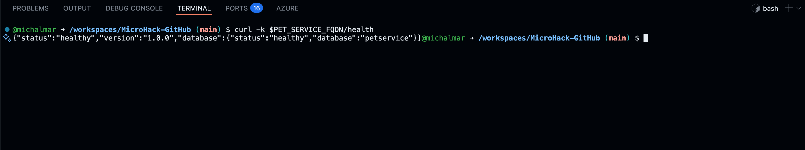
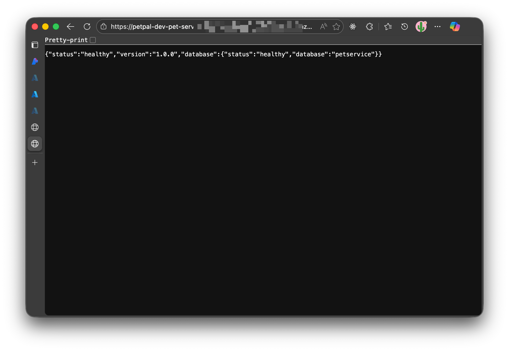
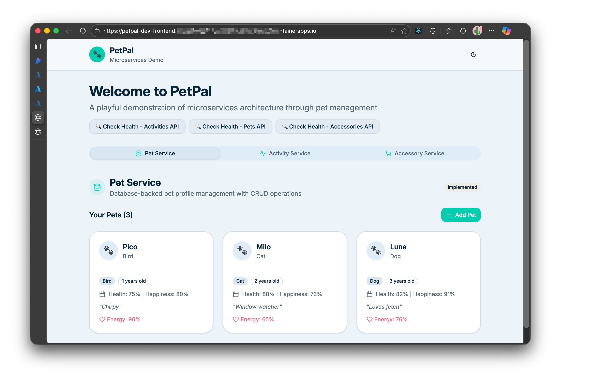

# Challenge 09: Deployment Automation using GitHub Actions

## Overview

Build a complete CI/CD pipeline for the PetPal microservices application using GitHub Actions.

## Learning Objectives

- Implement CI/CD pipelines for containerized microservices
- Learn GitHub Actions best practices and Azure Container Apps deployment

## Prerequisites

- Completed Challenge 08 (Infrastructure as Code deployed via `azd provision`)
- **Azure Container Registry (ACR) created in Challenge 08**
- GitHub repository with write permissions
- Azure Container Apps environment running (from Challenge 08)
- Understanding of Docker, GitHub Actions, and CI/CD concepts

**Required Information from Challenge 08:**
- ACR login server and registry name (e.g., `petpal12345.azurecr.io`, `petpalacr12345`)
- GitHub managed identity client ID (`githubManagedIdentityClientId` output)
- Azure tenant ID and subscription ID
- Resource group name
- Container App names for all services

## Architecture Context

Your PetPal application consists of:

**Backend Services (Python FastAPI):**
- **Pet Service** - Port 8010, manages pet data
- **Activity Service** - Port 8020, tracks pet activities  
- **Accessory Service** - Port 8030, manages pet accessories

**Frontend:**
- **React UI** - Port 80, connects to all backend services

**Infrastructure (Azure):**
- **Azure Container Apps Environment** with Log Analytics
- **Azure Cosmos DB** (serverless) for data persistence
- **4 Container Apps** (one per service + frontend)

Each service has its own Dockerfile and runs independently in Azure Container Apps.

---

## Tasks

### Task 1: Setup and Single Service Deployment

**Goal**: Deploy the Pet Service automatically with GitHub Actions.


#### 1.1 Configure GitHub Federated Identity

Before creating workflows, grant GitHub Actions access to Azure using the managed identity provisioned in Challenge 08.

Go to **Azure Portal → Managed Identities → [Your Identity] → Federated Identity Credentials**:


Setup the federated credential with your repo:


Get the **Client ID** from the identity overview page.


**Verify federated credential subject** (optional):

  ```bash
  az identity federated-credential list \
    --identity-name $(az identity list --resource-group $RESOURCE_GROUP --query "[?contains(name, '-gha-mi-')].name" -o tsv) \
    --resource-group $RESOURCE_GROUP \
    --query "[].subject"
  ```

  Ensure the output contains `repo:<owner>/<repo>:ref:refs/heads/main` (or the branch/environment you'll deploy from). Update the Challenge 08 parameters if you need additional subjects.

#### 1.2 Set GitHub Secrets and Variables

1. **Retrieve identity metadata and ACR details**

  ```bash
  REPO_FULL=$(gh repo view --json nameWithOwner -q .nameWithOwner)

  # Get resource group from azd environment
  RESOURCE_GROUP=$(azd env get-value AZURE_RESOURCE_GROUP)

  # Get Azure identity information
  AZURE_CLIENT_ID=$(az identity list --resource-group $RESOURCE_GROUP --query "[?contains(name, '-gha-mi-')].clientId" -o tsv)

  AZURE_TENANT_ID=$(az account show --query tenantId -o tsv)
  AZURE_SUBSCRIPTION_ID=$(az account show --query id -o tsv)

  # Get Azure Container Registry details
  ACR_NAME=$(az acr list --resource-group $RESOURCE_GROUP --query "[0].name" -o tsv)
  ACR_LOGIN_SERVER=$(az acr list --resource-group $RESOURCE_GROUP --query "[0].loginServer" -o tsv)

  echo "Repository: $REPO_FULL"
  echo "RESOURCE_GROUP=$RESOURCE_GROUP"
  echo "AZURE_CLIENT_ID=$AZURE_CLIENT_ID"
  echo "AZURE_TENANT_ID=$AZURE_TENANT_ID"
  echo "AZURE_SUBSCRIPTION_ID=$AZURE_SUBSCRIPTION_ID"
  echo "ACR_NAME=$ACR_NAME"
  echo "ACR_LOGIN_SERVER=$ACR_LOGIN_SERVER"
  ```

2. **Store GitHub secrets** (requires `repo` + `workflow` scopes on the GitHub CLI authentication):

> Note: if you see 403 errors, ensure your GitHub CLI authentication has the required scopes. example error message: `failed to fetch public key: HTTP 403: Resource not accessible by integration `
> 
> How to setup GitHub CLI authentication with proper scopes:
> - Run `gh auth login --scopes "repo,workflow"`
> - or refresh using `gh auth refresh --scopes "repo,workflow"`

  ```bash
  gh secret set AZURE_CLIENT_ID --body "$AZURE_CLIENT_ID" --repo "$REPO_FULL"
  gh secret set AZURE_TENANT_ID --body "$AZURE_TENANT_ID" --repo "$REPO_FULL"
  gh secret set AZURE_SUBSCRIPTION_ID --body "$AZURE_SUBSCRIPTION_ID" --repo "$REPO_FULL"
  ```


3. **Store GitHub variables** for common values:
  
  Retrieve backend microsservice managed identity client ID from Challenge 08 outputs and store as variables. These will be used in workflows to set environment variables.
  
  ```bash
  PET_SERVICE_CONTAINER_APP_NAME=$(azd env get-value petServiceName)
  PET_SERVICE_FQDN=$(azd env get-value petServiceUrl)
  PET_SERVICE_MI_CLIENT_ID=$(azd env get-value petServiceManagedIdentityClientId)
  
  ACTIVITY_SERVICE_CONTAINER_APP_NAME=$(azd env get-value activityServiceName)
  ACTIVITY_SERVICE_FQDN=$(azd env get-value activityServiceUrl)
  ACTIVITY_SERVICE_MI_CLIENT_ID=$(azd env get-value activityServiceManagedIdentityClientId)
  
  ACCESSORY_SERVICE_CONTAINER_APP_NAME=$(azd env get-value accessoryServiceName)
  ACCESSORY_SERVICE_FQDN=$(azd env get-value accessoryServiceUrl)
  ACCESSORY_SERVICE_MI_CLIENT_ID=$(azd env get-value accessoryServiceManagedIdentityClientId)
  
  COSMOS_ENDPOINT=$(azd env get-value cosmosEndpoint)

  echo "PET_SERVICE_CONTAINER_APP_NAME=$PET_SERVICE_CONTAINER_APP_NAME"
  echo "PET_SERVICE_FQDN=$PET_SERVICE_FQDN"
  echo "PET_SERVICE_MI_CLIENT_ID=$PET_SERVICE_MI_CLIENT_ID"
  echo "ACTIVITY_SERVICE_CONTAINER_APP_NAME=$ACTIVITY_SERVICE_CONTAINER_APP_NAME"
  echo "ACTIVITY_SERVICE_FQDN=$ACTIVITY_SERVICE_FQDN"
  echo "ACTIVITY_SERVICE_MI_CLIENT_ID=$ACTIVITY_SERVICE_MI_CLIENT_ID"
  echo "ACCESSORY_SERVICE_CONTAINER_APP_NAME=$ACCESSORY_SERVICE_CONTAINER_APP_NAME"
  echo "ACCESSORY_SERVICE_FQDN=$ACCESSORY_SERVICE_FQDN"
  echo "ACCESSORY_SERVICE_MI_CLIENT_ID=$ACCESSORY_SERVICE_MI_CLIENT_ID"
  echo "COSMOS_ENDPOINT=$COSMOS_ENDPOINT"
  ```
  Set variables in GitHub:
  ```bash
  gh variable set PET_SERVICE_CONTAINER_APP_NAME --body "$PET_SERVICE_CONTAINER_APP_NAME" --repo "$REPO_FULL"
  gh variable set PET_SERVICE_FQDN --body "$PET_SERVICE_FQDN" --repo "$REPO_FULL"
  gh variable set PET_SERVICE_MI_CLIENT_ID --body "$PET_SERVICE_MI_CLIENT_ID" --repo "$REPO_FULL"
  gh variable set ACTIVITY_SERVICE_CONTAINER_APP_NAME --body "$ACTIVITY_SERVICE_CONTAINER_APP_NAME" --repo "$REPO_FULL"
  gh variable set ACTIVITY_SERVICE_FQDN --body "$ACTIVITY_SERVICE_FQDN" --repo "$REPO_FULL"
  gh variable set ACTIVITY_SERVICE_MI_CLIENT_ID --body "$ACTIVITY_SERVICE_MI_CLIENT_ID" --repo "$REPO_FULL"
  gh variable set ACCESSORY_SERVICE_CONTAINER_APP_NAME --body "$ACCESSORY_SERVICE_CONTAINER_APP_NAME" --repo "$REPO_FULL"
  gh variable set ACCESSORY_SERVICE_FQDN --body "$ACCESSORY_SERVICE_FQDN" --repo "$REPO_FULL"
  gh variable set ACCESSORY_SERVICE_MI_CLIENT_ID --body "$ACCESSORY_SERVICE_MI_CLIENT_ID" --repo "$REPO_FULL"
  gh variable set COSMOS_ENDPOINT --body "$COSMOS_ENDPOINT" --repo "$REPO_FULL"
  gh variable set RESOURCE_GROUP --body "$RESOURCE_GROUP" --repo "$REPO_FULL"
  gh variable set ACR_NAME --body "$ACR_NAME" --repo "$REPO_FULL"
  gh variable set ACR_LOGIN_SERVER --body "$ACR_LOGIN_SERVER" --repo "$REPO_FULL"
  ```

#### 1.3 Create First GitHub Actions Workflow

Create `.github/workflows/deploy-pet-service.yml`, but instead of pasting a finished workflow, assemble it using the key building blocks below:

- **Triggers**: run on pushes to `main` that touch `backend/pet-service/**` (plus the workflow file) and support `workflow_dispatch` for manual runs.
- **Permissions**: grant `id-token: write` and `contents: read` so OIDC login works without long-lived credentials.
- **Environment variables**: reuse repository variables from step 1.2 for the (and not only) resource group, ACR, container app, managed identity, and Cosmos DB identifiers. Define `SERVICE_NAME` as `petpal-pet-service` and set the service path.
- **Steps**:
  - Checkout the repository (`actions/checkout@v4`).
  - Log in to Azure with `azure/login@v2` using the federated identity secrets from step 1.2.
  - Deploy with `azure/container-apps-deploy-action@v1`; build the image from `backend/pet-service` and push it to `${{ env.ACR_LOGIN_SERVER }}/petpal-pet-service:${{ github.sha }}`. Pass the Cosmos settings and managed identity client ID as environment variables.

If you like seeing the structure before filling in the details, start from a skeleton similar to:

```yaml
name: Deploy Pet Service
on:
  # TODO: add push + workflow_dispatch triggers
permissions:
  id-token: write
  contents: read
env:
  # TODO: wire up SERVICE_NAME, paths, and shared variables
jobs:
  build-and-deploy:
    runs-on: ubuntu-latest
    steps:
      # TODO: checkout, azure/login, and container-apps-deploy-action
```

Use the hints above to replace each `TODO` with the proper configuration.

**Pro Tip**: Ask GitHub Copilot to draft the workflow. For example:

```
@workspace Generate a GitHub Actions YAML that deploys backend/pet-service to Azure Container Apps using azure/login OIDC auth and azure/container-apps-deploy-action. Reuse repository variables for resource group, ACR, container app name, managed identity, and Cosmos settings.
```

**Required GitHub Secrets:**
- `AZURE_CLIENT_ID` - Managed identity client ID from Challenge 08 outputs
- `AZURE_TENANT_ID` - Azure tenant ID
- `AZURE_SUBSCRIPTION_ID` - Azure subscription ID

**Required GitHub Variables:**
- `RESOURCE_GROUP` - Azure resource group name
- `ACR_NAME` - Azure Container Registry name
- `ACR_LOGIN_SERVER` - Azure Container Registry login server
- `PET_SERVICE_CONTAINER_APP_NAME` - Pet Service Container App name
- `PET_SERVICE_MI_CLIENT_ID` - Pet Service managed identity client ID
- `PET_SERVICE_FQDN` - Pet Service Container App FQDN
- `COSMOS_ENDPOINT` - Cosmos DB account endpoint


> **Important**: The infrastructure now uses **Managed Identity with RBAC** for Cosmos DB authentication instead of master keys. Container Apps authenticate to Cosmos DB using their managed identities with the **Cosmos DB Data Contributor** role. No `COSMOS_KEY` secret is needed in Container App configuration.


Use the commands in **Step 1.2** to configure these secrets and variables. If you prefer the GitHub UI, add the same entries manually via **Settings → Secrets and variables → Actions**.


> **Heads-up**: Later sample workflows in this challenge previously referenced service principals and registry passwords. When following the managed identity path, reuse the `azure/login` configuration above (`auth-type: ID_TOKEN`) and rely on `az acr login` instead of `docker/login-action` with static credentials.

You can check the deployment progress in the **Actions** tab of your GitHub repository. Once the workflow completes, verify the Pet Service is running by accessing its HTTPS endpoint:

```bash
echo "Pet Service URL: $PET_SERVICE_FQDN/health"
curl -k $PET_SERVICE_FQDN/health
```


or access through your browser:




**📝 Task 1 Deliverables:**
- [ ] ACR verified and accessible (from Challenge 08)
- [ ] GitHub workload identity secrets/variables configured
- [ ] GitHub Actions workflow created and successfully deployed Pet Service
- [ ] Service accessible via HTTPS endpoint

---

### Task 2: Deploy All Microservices

**Goal**: Create deployment workflows for all three backend services and the frontend.

#### 2.1 Verify Existing Dockerfiles

All services already have Dockerfiles in their respective directories:
- `backend/pet-service/Dockerfile` ✓
- `backend/activity-service/Dockerfile` (verify/create if missing)
- `backend/accessory-service/Dockerfile` (verify/create if missing)
- Frontend Dockerfile is in Github repository

**If any Dockerfiles are missing**, copy and adapt from the Pet Service:


#### 2.2 Create Workflow for Each Backend Service

Create workflows following the Pet Service pattern. Each backend service needs:
- **Cosmos DB connection** (endpoint, database name, container name)
  - **Note**: No `COSMOS_KEY` needed - services use Managed Identity with RBAC
- **Service-specific port** (8010, 8020, 8030)
- **Unique image name** and Container App name

**Create `.github/workflows/deploy-activity-service.yml`:**

```yaml
name: Deploy Activity Service

...
```

**Create `.github/workflows/deploy-accessory-service.yml`:**
```yaml
name: Deploy Accessory Service
...
```

**Pro Tip**: Use GitHub Copilot to generate:
```
@workspace Create a GitHub Actions workflow for deploying the Accessory Service to Azure Container Apps. 
Follow the same pattern as deploy-activity-service.yml but adjust for:
- Service location: backend/accessory-service
- Image name: petpal-accessory-service
- Database: accessoryservice
- Container: accessories
```
> **Security Note**: All backend services authenticate to Cosmos DB using their **user-assigned managed identities** with RBAC. The infrastructure grants each Container App's managed identity the **Cosmos DB Data Contributor** role (`00000000-0000-0000-0000-000000000002`) for data operations and **DocumentDB Account Contributor** role (`5bd9cd88-fe45-4216-938b-f97437e15450`) for database/container creation. This eliminates the need to manage and rotate Cosmos DB master keys in secrets.

**📝 Task 2 Deliverables:**
- [ ] All services have Dockerfiles (verify existing, create if missing)
- [ ] GitHub Actions workflows for all three services (pet, activity, accessory)
- [ ] All workflows successfully deploy on push to main
- [ ] All services accessible and functional
- [ ] Verify Managed Identity authentication to Cosmos DB is working (check health endpoints)
- [ ] Frontend connects to all backend services correctly


After completing these tasks, you will have a fully automated CI/CD pipeline deploying all microservices of the PetPal application using GitHub Actions and Azure Container Apps with secure managed identity authentication.

The app should be fully functional with all services communicating correctly. You can verify by accessing the frontend:


---
## Challenge Summary
In this challenge, you built a robust CI/CD pipeline for the PetPal microservices application using GitHub Actions. You started with deploying a single service and progressively added workflows for all backend services and the frontend. You learned to leverage managed identities for secure authentication to Azure resources, eliminating the need for sensitive keys in your configurations.

---

## Additional Resources

### Official Documentation
- [GitHub Actions Documentation](https://docs.github.com/en/actions)
- [Azure Container Apps Deployment](https://docs.microsoft.com/azure/container-apps/)
- [Docker Best Practices](https://docs.docker.com/develop/dev-best-practices/)
- [Azure CLI Reference](https://docs.microsoft.com/cli/azure/)

### GitHub Actions for Azure
- [Azure Login Action](https://github.com/Azure/login)
- [Container Apps Deploy Action](https://github.com/Azure/container-apps-deploy-action)
- [Docker Build Push Action](https://github.com/docker/build-push-action)

### Security & Best Practices
- [Security Hardening for GitHub Actions](https://docs.github.com/en/actions/security-guides/security-hardening-for-github-actions)
- [Azure Security Baseline for Container Apps](https://docs.microsoft.com/security/benchmark/azure/baselines/container-apps-security-baseline)
- [OWASP Container Security](https://owasp.org/www-project-docker-security/)

### CI/CD Patterns
- [Deployment Strategies](https://docs.microsoft.com/azure/architecture/guide/deployment-strategies/)
- [GitOps with GitHub Actions](https://docs.github.com/en/actions/deployment/about-deployments)
- [Trunk-Based Development](https://trunkbaseddevelopment.com/)

---

## Solution

Detailed solution with complete workflow examples and step-by-step implementation:

[Solution Steps](/solutions/challenge-09/README.md)