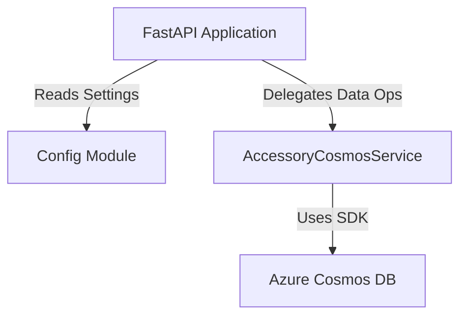

# Service Architecture Snapshot

Provide a focused view of how this service fits into the broader system while inheriting global context from `../../platform/ARCHITECTURE.md`.

## Context
The **Accessory Service** is responsible for managing pet accessories. It handles the inventory of items like toys, food, collars, etc., including stock management and categorization. It delegates persistence to Azure Cosmos DB.

**Dependencies:**
-   **Upstream**: Frontend App (calls API).
-   **Downstream**: Azure Cosmos DB (stores data in `accessories` container).

## Component Diagram

### Configuration Strategy
The service uses a centralized `config.py` module to manage settings:
1.  **Environment Variables**: Primary source of configuration.
2.  **Dotenv Support**: Loads `.env` files for local development convenience.
3.  **Validation**: The `Settings` class validates presence of critical keys (e.g., `COSMOS_ENDPOINT`).
4.  **Environment Detection**: Automatically detects if running against a local Emulator (localhost) or Azure.

## Data Flow
1.  **Request**: HTTP Request hits FastAPI endpoint (e.g., `POST /api/accessories`).
2.  **Validation**: Pydantic models (`AccessoryCreate`) validate the payload structure and types.
3.  **Service Layer**: `AccessoryCosmosService` constructs the item dictionary, generating IDs and timestamps.
4.  **Persistence**: The Azure Cosmos DB SDK executes the operation against the `accessories` container.
5.  **Response**: The created/retrieved entity is returned as JSON.

## Cross-Cutting Concerns

### Resilience
-   **Database Connection**: Lazy initialization pattern. The service does not connect to Cosmos DB during `__init__()`. It connects only when the first operation is attempted using `_ensure_initialized()`.
-   **Error Handling**:
    -   Catches `CosmosResourceNotFoundError` for 404 cases.
    -   Catches `CosmosResourceExistsError` for duplicate IDs.
    -   Logs all operations and errors.
    -   Re-raises exceptions for FastAPI to handle.

### Performance
-   **Pagination**: Handles large datasets with offset/limit pagination.
-   **Search**: Builds dynamic SQL queries based on filters (type, low stock) and text search (name, description).

### Health Check with Auto-Setup
-   The `/health` endpoint tries to query the container.
-   If the database or container doesn't exist, it creates them automatically.
-   Seeds the container with 2 sample accessories (one toy, one food item with low stock) if created.

## Decision References
-   **Service-Specific ADR**: Use of Pydantic for dual purpose: API validation and internal data modeling.
