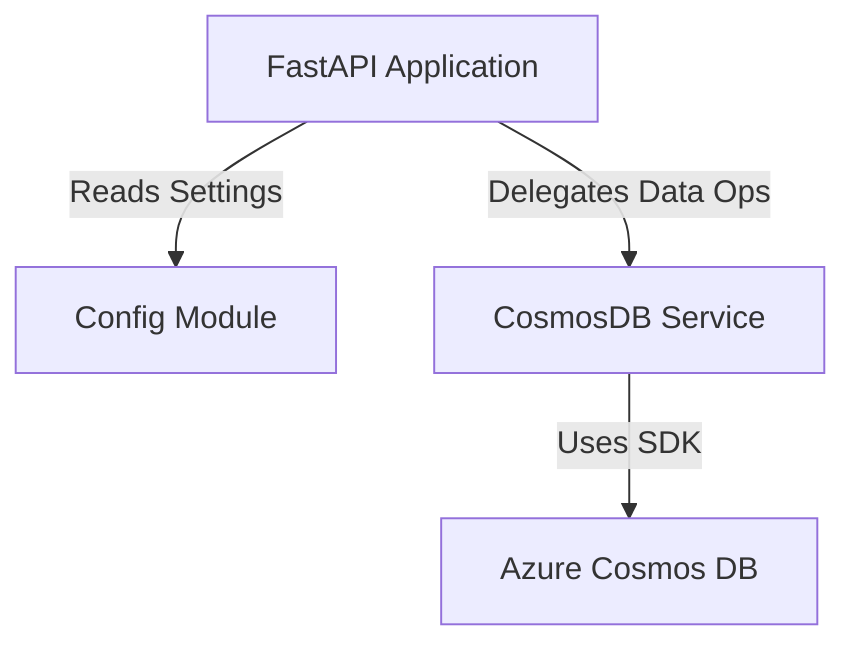

# Service Architecture Snapshot

Provide a focused view of how this service fits into the broader system while inheriting global context from `../../platform/ARCHITECTURE.md`.

## Context
The **Accessory Service** manages the inventory of pet accessories. It provides CRUD operations, search, and filtering capabilities for accessories like toys, food, collars, etc. It is designed to be a stateless microservice that delegates persistence to Azure Cosmos DB.

**Dependencies:**
-   **Upstream**: Frontend App (calls API).
-   **Downstream**: Azure Cosmos DB (stores data).

## Component Diagram

## Database Strategy
**CosmosDB** is used for data persistency.

**Lazy Initialization Pattern:**
   - Don't connect to Cosmos DB during `__init__()`.
   - Connect only when first operation is attempted.
   - Use `_ensure_initialized()` before each database operation.

**Health Check with Auto-Setup:**
   - Try to query the container.
   - If database/container doesn't exist, create it automatically.
   - Seed with 2 sample accessories (one toy, one food item with low stock).

**Search Implementation:**
   - Build dynamic SQL query based on filters.
   - Emulator do NOT support tautologies like `WHERE 1=1`, do not use it to simply concat filters, implement proper list-building patterns.
   - Support text search in name and description (`CONTAINS`).
   - Support type filtering.
   - Support low stock filtering (stock < 10).
   - Add pagination with `OFFSET` and `LIMIT`.
   - Order results by `createdAt DESC`.

**Error Handling:**
   - Catch `CosmosResourceNotFoundError` for 404 cases.
   - Catch `CosmosResourceExistsError` for duplicate IDs.
   - Log all operations and errors.
   - Re-raise exceptions for FastAPI to handle.

## Data Flow
1.  **Request**: HTTP Request hits FastAPI endpoint (e.g., `POST /api/accessories`).
2.  **Validation**: Pydantic models (`AccessoryCreate`) validate the payload structure and types.
3.  **Service Layer**: `CosmosDBService` constructs the item dictionary, generating IDs and timestamps.
4.  **Persistence**: The Azure Cosmos DB SDK executes the operation against the `accessories` container.
5.  **Response**: The created/retrieved entity is returned as JSON.

## Cross-Cutting Concerns

### Resilience
-   **Database Connection**: Lazy initialization pattern to ensure service startup doesn't crash immediately if DB is unreachable.
-   **Error Handling**: Global exception handlers convert DB errors into standardized HTTP 500/404 responses.

### Performance
-   **Async/Await**: The service utilizes Python's `asyncio` capabilities.
-   **Caching**: `lru_cache` is used for configuration settings.
