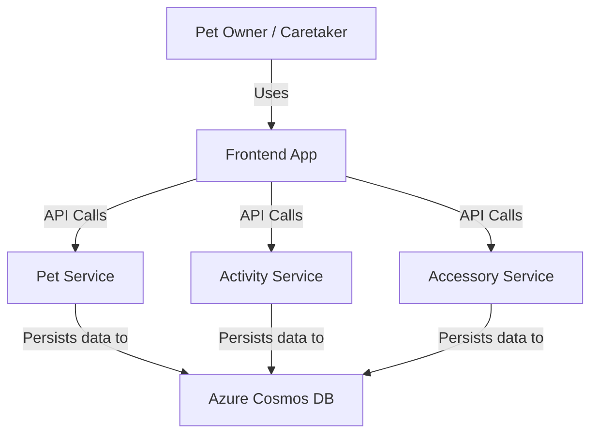

# Architecture Overview

Capture system context, component boundaries, and key decisions that drive implementation.

## Context
PetPal is a cohesive web experience that allows pet owners to view, edit, and monitor pets alongside their activity history. The system unifies pet management and activity logging into a single dashboard, backed by scalable cloud-native services.

**Business Drivers:**
- Faster pet onboarding.
- Richer engagement with activity timelines.
- Improved operational reliability.

**Personas:**
- **Household Pet Owner**: Quick overview, edit details, log walks/feeds.
- **Caretaker/Staff**: Manage multiple pets, filter by status.
- **Clinic/Trainer Partner**: Record structured visits.

## Views

### System Context Diagram
The PetPal Platform sits at the center, interacting with users via a web interface and persisting data to Azure Cosmos DB.

### Container / Service View

| Component             | Responsibility                                                      | Tech Stack              | Deployment Target          | Owners        |
| --------------------- | ------------------------------------------------------------------- | ----------------------- | -------------------------- | ------------- |
| **Frontend**          | User interface for dashboard, pet management, and activity logging. | React                   | Azure Container Apps       | Frontend Team |
| **Pet Service**       | Manages pet profiles, metadata, and CRUD operations.                | Python (FastAPI)        | Azure Container Apps       | Backend Team  |
| **Activity Service**  | Manages activity logs, timelines, and historical data.              | Python (FastAPI)        | Azure Container Apps       | Backend Team  |
| **Accessory Service** | Manages pet accessories, inventory, and CRUD operations.            | Python (FastAPI)        | Azure Container Apps       | Backend Team  |
| **Database**          | Centralized NoSQL store for all pet and activity data.              | Azure Cosmos DB (NoSQL) | Azure Cosmos DB Serverless | Platform Team |

### Data Flow
1.  **User Interaction**: User performs an action (e.g., "Create Pet") on the Frontend.
2.  **API Request**: Frontend sends an authenticated HTTPS request to the relevant service (Pet, Activity, or Accessory Service).
3.  **Persistence**: Service validates the request and writes/reads from Azure Cosmos DB.
4.  **Response**: Service returns JSON response to Frontend; Frontend updates UI.

## Cross-Cutting Concerns

### Security Posture
-   **Authentication**: None (Public access for workshop/demo purposes).
-   **Authorization**: Service-to-service and user-to-service boundaries (future scope).
-   **Secrets Management**: Managed Identity for Azure resources; Environment variables for configuration.
-   **Transport**: HTTPS enforced everywhere.

### Performance Characteristics
-   **Latency Targets**: P95 < 300ms for reads, < 500ms for writes.
-   **Scaling**: Stateless services scale horizontally via Azure Container Apps (KEDA). Database scales via Cosmos DB Serverless/Autoscale.

### Resilience
-   **Retries**: SDK-level retries for Cosmos DB (429s).
-   **Availability**: Multi-region writes (future); Local emulator for development parity.

### Observability
-   **Logging**: Structured logs with `traceparent` propagation.
-   **Metrics**: RU usage, HTTP status codes, Application Insights integration.

## Dependencies
-   **Azure Cosmos DB**: Primary data store.
-   **Azure Container Apps**: Compute platform.

## Specification by Example

| Scenario                | Given                                     | When                               | Then                                                                     |
| ----------------------- | ----------------------------------------- | ---------------------------------- | ------------------------------------------------------------------------ |
| **High Load**           | Traffic spikes to 10x normal load         | Users continue to access dashboard | Container Apps scale out replicas; Cosmos DB scales RUs automatically.   |
| **Database Throttling** | Cosmos DB returns 429 (Too Many Requests) | Service attempts to write data     | SDK automatically retries with backoff; Request succeeds within timeout. |

## Decision References
-   **ADR-001**: Use of Azure Cosmos DB for schema flexibility and scalability.
-   **ADR-002**: Microservices architecture (Pet vs. Activity vs. Accessory) to allow independent scaling and lifecycle management.
