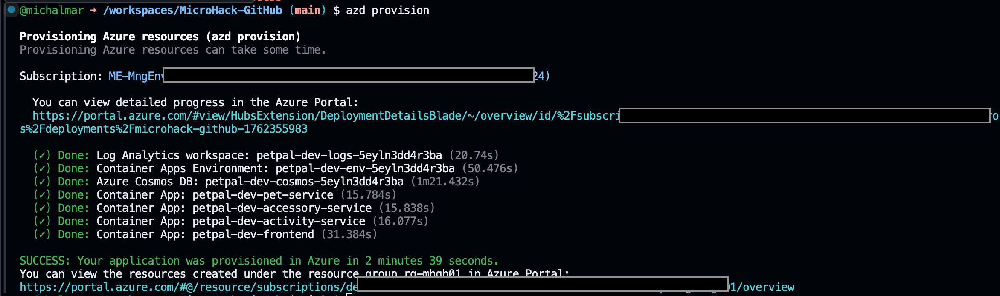
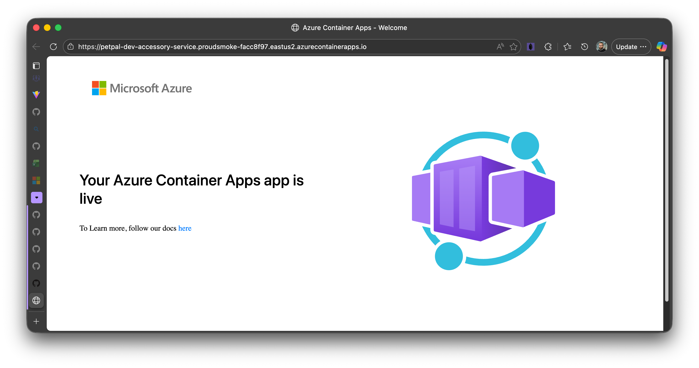

# Solution: Challenge 08 - Infrastructure as Code and Access Models

This solution provides a complete Infrastructure as Code (IaC) implementation using Azure Bicep for deploying the PetPal microservices application to Azure Container Apps.

## Overview

The solution implements a production-ready infrastructure that includes:

- **Azure Container Apps Environment** with centralized logging
- **Azure Cosmos DB** (serverless) for data persistence
- **Azure Container Registry** (ACR) for Docker image storage
- **Four Container Apps**: Pet Service, Activity Service, Accessory Service, and Frontend
- **User-Assigned Managed Identities**: One per backend service for secure ACR image pull
- **Security best practices**: No admin credentials, managed identity authentication, secrets management, HTTPS-only
- **Auto-scaling configuration** for all services
- **Modular Bicep templates** for maintainability and reusability

## Architecture

```
┌─────────────────────────────────────────────────────────────┐
│              Azure Container Apps Environment               │
│                                                             │
│  ┌──────────────┐  ┌──────────────┐  ┌──────────────┐      │
│  │ Pet Service  │  │Activity Svc  │  │Accessory Svc │      │
│  │   (8010)     │  │   (8020)     │  │   (8030)     │      │
│  │              │  │              │  │              │      │
│  │  [MI-Pet]    │  │ [MI-Activity]│  │[MI-Accessory]│      │
│  └──────┬───────┘  └──────┬───────┘  └──────┬───────┘      │
│         │                 │                 │              │
│         └────────┬────────┴────────┬────────┘              │
│                  │                 │                       │
│           ┌──────▼─────────────────▼──────┐                │
│           │  Azure Container Registry     │                │
│           │  (AcrPull via Managed IDs)    │                │
│           └───────────────────────────────┘                │
│                                                             │
│         ┌─────────────────┴─────────────────┐              │
│         │                                   │              │
│  ┌──────▼───────┐                    ┌──────▼───────┐      │
│  │   Cosmos DB  │                    │   Frontend   │      │
│  │  (Serverless)│                    │   (Port 80)  │      │
│  └──────────────┘                    └──────────────┘      │
└─────────────────────────────────────────────────────────────┘
                           │
                    ┌──────▼───────┐
                    │Log Analytics │
                    │  Workspace   │
                    └──────────────┘

Legend: [MI-*] = User-Assigned Managed Identity for ACR Pull
```

## Solution Structure

All infrastructure code is located in the `/infra` directory:

```
infra/
├── main.bicep                           # Main orchestration template
├── main.parameters.json                 # Default parameters
├── cosmos.bicep                         # Cosmos DB module
├── acr.bicep                            # Azure Container Registry module
├── container-app-environment.bicep      # Container Apps environment
├── container-app.pet-service.bicep      # Pet service
├── container-app.activity-service.bicep # Activity service
├── container-app.accessory-service.bicep# Accessory service
├── container-app.frontend.bicep         # Frontend UI
└── README.md                            # Deployment guide
```

## Step-by-Step Implementation

### Task 1: Infrastructure Design ✅

**Design Decisions:**

1. **Service Choice**: Azure Container Apps selected for:
   - Native container support with minimal configuration
   - Built-in auto-scaling and load balancing
   - Integrated ingress with automatic HTTPS
   - Cost-effective serverless compute model
   - Easy integration with Cosmos DB

2. **Database Choice**: Cosmos DB Serverless for:
   - Pay-per-request pricing model (ideal for development)
   - Global distribution capabilities
   - NoSQL flexibility
   - Automatic scaling
   - Multi-API support (SQL API used)

3. **Container Registry Choice**: Azure Container Registry (ACR) for:
   - Native Azure integration with Container Apps
   - Secure Docker image storage
   - Geo-replication capabilities (for production)
   - Built-in vulnerability scanning (with Defender for Cloud)
   - Managed identity support for credential-free image pull
   - Workload identity federation support for GitHub Actions (no admin credentials)

4. **Managed Identity Architecture**:
   - **Separation of concerns**: Each backend service has its own user-assigned managed identity
   - **Least privilege**: Each identity only has `AcrPull` permission scoped to ACR
   - **Security isolation**: Compromised identity doesn't affect other services
   - **Independent lifecycle**: Services can be deployed/deleted without affecting others
   - **Best practice alignment**: Follows Azure Well-Architected Framework security principles
   - Separate Bicep modules for each component
   - Reusable templates for services
   - Clear separation of concerns
   - Easy to maintain and extend

### Task 2: Identity and Access Management ✅

**Security Implementation:**

1. **Managed Identity for ACR Authentication**:
   - Each backend service (pet, activity, accessory) has a dedicated user-assigned managed identity
   - Each identity is granted `AcrPull` role scoped to the Azure Container Registry
   - Container Apps configured to use managed identity for image pull authentication
   - No admin credentials or passwords required
   - Follows principle of least privilege and security isolation

**Rationale for Separate Identities:**
   - **Least Privilege**: Each service gets only what it needs
   - **Blast Radius Reduction**: Compromised identity doesn't affect other services
   - **Independent Lifecycle**: Services can be deployed/deleted independently
   - **Audit Trail**: Clear 1:1 mapping between identity and service
   - **Microservices Alignment**: Each autonomous service manages its own identity
   - **Future Flexibility**: Easy to add service-specific permissions (Key Vault, Storage, etc.)

**Implementation Pattern (Per Service):**
   ```bicep
   // Create user-assigned managed identity
   resource serviceIdentity 'Microsoft.ManagedIdentity/userAssignedIdentities@2023-01-31' = {
     name: '${name}-identity'
     location: location
   }

   // Reference ACR
   resource acr 'Microsoft.ContainerRegistry/registries@2023-07-01' existing = if (acrName != '') {
     name: acrName
   }

   // Grant AcrPull role (scoped to ACR, not resource group)
   resource acrPullRoleAssignment 'Microsoft.Authorization/roleAssignments@2022-04-01' = if (acrName != '') {
     name: guid(acr.id, serviceIdentity.id, 'acrpull')
     scope: acr
     properties: {
       roleDefinitionId: subscriptionResourceId('Microsoft.Authorization/roleDefinitions', '7f951dda-4ed3-4680-a7ca-43fe172d538d')
       principalId: serviceIdentity.properties.principalId
       principalType: 'ServicePrincipal'
     }
   }

   // Configure Container App with identity and registry
   resource containerApp 'Microsoft.App/containerApps@2024-03-01' = {
     identity: {
       type: 'UserAssigned'
       userAssignedIdentities: {
         '${serviceIdentity.id}': {}
       }
     }
     properties: {
       configuration: {
         registries: [
           {
             server: acrLoginServer
             identity: serviceIdentity.id  // Use managed identity for auth
           }
         ]
       }
     }
   }
   ```

2. **Secrets Management**:
   - Cosmos DB keys stored as Container App secrets
   - Secrets referenced via `secretRef` in environment variables
   - Never exposed in logs or outputs (marked with `@secure()`)

3. **Network Security**:
   - HTTPS-only ingress configuration
   - Public network access (can be restricted to VNet)
   - Each service exposed on unique ports

4. **GitHub Workload Identity**:
  - User-assigned managed identity provisioned for GitHub Actions
  - Federated credentials trust `repo:michalmar/MicroHack-GitHub:ref:refs/heads/main`
  - RBAC grants `Contributor` on the resource group and `AcrPush` on the registry—no secrets needed

### Task 3: Core Infrastructure Implementation ✅

**Components Implemented:**

1. **Cosmos DB Account** (`cosmos.bicep`):
   ```bicep
   - Serverless capability enabled
   - Session consistency level (balanced performance)
   - Single region deployment
   - Automatic failover disabled (cost optimization)
   ```

2. **Azure Container Registry** (`acr.bicep`):
   ```bicep
  - Basic SKU (cost-effective for development)
  - Admin user disabled to avoid shared credentials
  - Located in same region as Container Apps
  - Outputs: loginServer, name, resource ID for role assignments
   ```

3. **Container Apps Environment** (`container-app-environment.bicep`):
   ```bicep
   - Log Analytics workspace integration
   - 30-day log retention
   - Centralized logging for all apps
   ```

4. **Backend Services** (pet, activity, accessory):
   ```bicep
   - User-assigned managed identity per service
   - AcrPull role assignment on ACR (scoped to registry)
   - Registry configuration with managed identity authentication
   - 0.5 CPU, 1GB memory per replica
   - Auto-scale: 1-10 replicas
   - HTTP scaling based on 10 concurrent requests
   - Environment variables for Cosmos DB connection
   - Secrets for Cosmos DB keys
   ```

5. **Frontend** (`container-app.frontend.bicep`):
   ```bicep
   - 0.5 CPU, 1GB memory per replica
   - Auto-scale: 1-5 replicas
   - HTTP scaling based on 50 concurrent requests
   - Environment variables for backend service URLs
   ```

### Task 4: Environment Variables Configuration ✅

**ACR Configuration:**
The ACR module (`acr.bicep`) creates:
- Azure Container Registry with Basic SKU
- Admin user disabled (GitHub pushes via managed identity + AcrPush role)
- Public network access enabled
- Outputs for loginServer, name, and id

**Backend Services Environment:**
- `COSMOS_ENDPOINT`: Cosmos DB endpoint URL
- `COSMOS_KEY`: Primary key (stored as secret)
- `COSMOS_DATABASE_NAME`: Service-specific database name
- `COSMOS_CONTAINER_NAME`: Service-specific container name

**Frontend Environment:**
- `VITE_API_PETS_URL`: Pet service FQDN (HTTPS)
- `VITE_API_ACTIVITIES_URL`: Activity service FQDN (HTTPS)
- `VITE_API_ACCESSORIES_URL`: Accessory service FQDN (HTTPS)

**Note**: Container image pushes use Azure workload identity federation; no admin credentials are exposed or required.

### Task 5: Deployment Instructions

**Prerequisites:**
```bash
# Install Azure CLI
az version

# Install Azure Developer CLI (azd)
# Windows (winget)
winget install microsoft.azd

# Linux/macOS (curl)
curl -fsSL https://aka.ms/install-azd.sh | bash

# Verify installation
azd version

# Login to Azure
az login
azd auth login

# Set subscription (if you have multiple)
az account set --subscription <subscription-id>
```

**Deploy Infrastructure Using Azure Developer CLI (Recommended):**

The Azure Developer CLI (azd) provides a streamlined experience for deploying Bicep infrastructure:

```bash
# Navigate to project root
cd /workspaces/MicroHack-GitHub

# Initialize azd environment (first time only)
azd init

# Provision infrastructure
azd provision

# Follow the prompts:
# - Select subscription
# - Enter environment name (e.g., dev)
# - Select Azure location (e.g., eastus)
```

**What `azd provision` does:**
1. Creates resource group automatically
2. Validates Bicep templates
3. Deploys all infrastructure resources
4. Displays deployment outputs
5. Saves environment configuration for reuse

**Alternative: Manual Azure CLI Deployment**

If you prefer to use Azure CLI directly:

```bash
# Navigate to infra directory
cd /workspaces/MicroHack-GitHub/infra

# Create resource group
az group create --name petpal-rg --location eastus

# Validate deployment (optional but recommended)
az deployment group validate \
  --resource-group petpal-rg \
  --template-file main.bicep \
  --parameters main.parameters.json

# Deploy infrastructure
az deployment group create \
  --resource-group petpal-rg \
  --template-file main.bicep \
  --parameters main.parameters.json \
  --name petpal-infrastructure

# Monitor deployment
az deployment group show \
  --resource-group petpal-rg \
  --name petpal-infrastructure \
  --query properties.provisioningState
```

**Retrieve Deployment Outputs:**

Using azd:
```bash
# View environment configuration
azd env get-values

# Get specific outputs
azd env get-value AZURE_CONTAINER_APPS_ENVIRONMENT_NAME
```

Using Azure CLI:
```bash
# Get all outputs
az deployment group show \
  --resource-group petpal-rg \
  --name petpal-infrastructure \
  --query properties.outputs

# Get frontend URL
az deployment group show \
  --resource-group petpal-rg \
  --name petpal-infrastructure \
  --query properties.outputs.frontendUrl.value -o tsv
```

**Update Infrastructure:**

Using azd:
```bash
# Reprovision infrastructure with changes
azd provision
```

Using Azure CLI:
```bash
# Redeploy with updated templates
az deployment group create \
  --resource-group petpal-rg \
  --template-file main.bicep \
  --parameters main.parameters.json \
  --name petpal-infrastructure
```

**Clean Up Resources:**

Using azd:
```bash
# Delete all resources
azd down
```

Using Azure CLI:
```bash
# Delete resource group (removes all resources)
az group delete --name petpal-rg --yes --no-wait
```

## Key Learning Points

### 1. Infrastructure as Code Benefits
- **Repeatability**: Deploy same infrastructure consistently across environments
- **Version Control**: Track infrastructure changes in Git
- **Documentation**: Code serves as living documentation
- **Automation**: Integrate with CI/CD pipelines
- **Testing**: Validate before deployment

### 2. Azure Developer CLI Advantages
- **Simplified Workflow**: Single command to provision all resources
- **Environment Management**: Easily manage multiple environments (dev, staging, prod)
- **Integrated Experience**: Works seamlessly with Bicep templates
- **CI/CD Ready**: Built-in support for GitHub Actions and Azure Pipelines
- **Convention-Based**: Follows Azure best practices by default

### 3. Azure Container Registry Best Practices
- **Modular Template**: Separate ACR module for reusability
- **Admin Credentials**: Disabled so no shared secrets are generated
- **Deployment Identity**: GitHub workload identity receives `AcrPush` for image publishing
- **Naming Convention**: ACR names cannot contain hyphens (handled in template)
- **Integration**: Native integration with Container Apps for image pulling

### 4. Azure Container Apps Best Practices
- **Modular Templates**: Separate modules for different resource types
- **Managed Identity per Service**: Each microservice has isolated security boundary
- **AcrPull Role Scoping**: Roles scoped to specific resources, not resource group
- **Parameterization**: Make templates flexible with parameters
- **Secrets Management**: Never hardcode sensitive values
- **Resource Dependencies**: Use module outputs for dependencies
- **Naming Conventions**: Use consistent, descriptive names
- **Registry Authentication**: Use managed identity instead of admin credentials

### 5. Security Principles Applied
- **Least Privilege**: Each service has only the permissions it needs (AcrPull for image pull)
- **Identity Isolation**: Each microservice has its own managed identity
- **No Shared Credentials**: Managed identities eliminate password sharing
- **Secrets Protection**: Cosmos keys stored as secrets, not plain text
- **HTTPS Enforcement**: All ingress configured for secure transport
- **Network Isolation**: Services communicate within Container Apps environment
- **Audit Ready**: All actions logged to Log Analytics
- **Credential Security**: CI/CD uses federated managed identity instead of stored credentials
- **Blast Radius Reduction**: Compromised identity only affects one service

### 6. Cosmos DB Serverless Advantages
- **Cost-Effective**: Pay only for operations consumed
- **Auto-Scaling**: No throughput provisioning required
- **Ideal for Dev/Test**: Perfect for variable workloads
- **Migration Path**: Can upgrade to provisioned throughput later

### 7. Scaling Configuration
- **Horizontal Scaling**: Replicas increase based on load
- **Metric-Based**: HTTP concurrency triggers scaling
- **Min/Max Replicas**: Prevents over/under scaling
- **Cost Control**: Max replicas limit prevents runaway costs

## Common Pitfalls and Solutions

### Pitfall 1: Using Shared Credentials for ACR
**Problem**: Enabling admin user and sharing ACR credentials across services
**Solution**: Each backend service has its own managed identity with AcrPull role; no admin credentials needed

### Pitfall 2: Missing Managed Identity Configuration
**Problem**: Container Apps can't pull images from ACR due to authentication failure
**Solution**: Create user-assigned managed identity, grant AcrPull, configure registry authentication in Container App

### Pitfall 3: Missing Secrets Configuration
**Problem**: Cosmos key not added to secrets section
**Solution**: Each backend service includes secrets configuration with cosmos-key

### Pitfall 4: Incorrect Environment Variable References
**Problem**: Using `value` instead of `secretRef` for secrets
**Solution**: Secrets use `secretRef`, non-sensitive values use `value`

### Pitfall 5: Port Mismatch
**Problem**: Container App targetPort doesn't match service port
**Solution**: Verified ports: Pet (8010), Activity (8020), Accessory (8030), Frontend (80)

### Pitfall 6: Missing Dependencies
**Problem**: Services deployed before Cosmos DB ready
**Solution**: Used module outputs to create implicit dependencies

### Pitfall 7: Hardcoded Secrets in Outputs
**Problem**: Bicep warning about secrets in outputs
**Solution**: Outputs expose endpoints, not keys. Keys passed securely to services only.

### Pitfall 8: Role Assignment Scope Issues
**Problem**: AcrPull role assigned at resource group level instead of ACR resource
**Solution**: Use `scope: acr` in role assignment to grant permissions on specific ACR resource

## Success Validation

### Verify Deployment

Using azd:
```bash
# Check deployment status
azd env get-values

# View resource group
azd env get-value AZURE_RESOURCE_GROUP

# Monitor deployment (if still in progress)
azd monitor

# Verify managed identities were created
RESOURCE_GROUP=$(azd env get-value AZURE_RESOURCE_GROUP)
az identity list --resource-group $RESOURCE_GROUP --query "[?contains(name, 'identity')].[name]" -o table

# Verify AcrPull role assignments on ACR
ACR_NAME=$(azd env get-value ACR_NAME)
az role assignment list \
  --scope $(az acr show -n $ACR_NAME --query id -o tsv) \
  --query "[?roleDefinitionName=='AcrPull'].[principalId, scope]" -o table
```

Final result should look like this:



Using Azure CLI:
```bash
# Get resource group from azd environment
RESOURCE_GROUP=$(azd env get-value AZURE_RESOURCE_GROUP)

# List all Container Apps
az containerapp list \
  --resource-group $RESOURCE_GROUP \
  --output table

# Check Container Apps Environment
az containerapp env list \
  --resource-group $RESOURCE_GROUP \
  --output table

# Check Cosmos DB account
az cosmosdb list \
  --resource-group $RESOURCE_GROUP \
  --output table

# Check Azure Container Registry
az acr list \
  --resource-group $RESOURCE_GROUP \
  --output table
```

### Capture Managed Identity Metadata (for Challenge 09)

After deployment, gather the managed identity details required for GitHub workload identity federation:

```bash
# Get resource group
RESOURCE_GROUP=$(azd env get-value AZURE_RESOURCE_GROUP)

# Identify the most recent deployment
DEPLOYMENT_NAME=$(az deployment group list \
  --resource-group $RESOURCE_GROUP \
  --query "[0].name" -o tsv)

# Retrieve managed identity outputs
AZURE_CLIENT_ID=$(az deployment group show \
  --resource-group $RESOURCE_GROUP \
  --name $DEPLOYMENT_NAME \
  --query properties.outputs.githubManagedIdentityClientId.value -o tsv)

MANAGED_IDENTITY_OBJECT_ID=$(az deployment group show \
  --resource-group $RESOURCE_GROUP \
  --name $DEPLOYMENT_NAME \
  --query properties.outputs.githubManagedIdentityPrincipalId.value -o tsv)

MANAGED_IDENTITY_RESOURCE_ID=$(az deployment group show \
  --resource-group $RESOURCE_GROUP \
  --name $DEPLOYMENT_NAME \
  --query properties.outputs.githubManagedIdentityResourceId.value -o tsv)

echo "AZURE_CLIENT_ID=$AZURE_CLIENT_ID"
echo "MANAGED_IDENTITY_OBJECT_ID=$MANAGED_IDENTITY_OBJECT_ID"
echo "MANAGED_IDENTITY_RESOURCE_ID=$MANAGED_IDENTITY_RESOURCE_ID"

# Tenant and subscription IDs (needed for azure/login)
AZURE_TENANT_ID=$(az account show --query tenantId -o tsv)
AZURE_SUBSCRIPTION_ID=$(az account show --query id -o tsv)

echo "AZURE_TENANT_ID=$AZURE_TENANT_ID"
echo "AZURE_SUBSCRIPTION_ID=$AZURE_SUBSCRIPTION_ID"
```

Store `AZURE_CLIENT_ID`, `AZURE_TENANT_ID`, and `AZURE_SUBSCRIPTION_ID` as GitHub secrets (or environment secrets). The object and resource IDs are helpful for auditing role assignments and troubleshooting.

### Test Endpoints

Using azd to get URLs:
```bash
# Get all environment values (includes service URLs from outputs)
azd env get-values

# Get specific service URL
FRONTEND_URL=$(azd env get-value FRONTEND_URL)

# Test frontend (should return 200 or 301)
curl -I $FRONTEND_URL
```

Using Azure CLI:
```bash
# Get resource group from azd environment
RESOURCE_GROUP=$(azd env get-value AZURE_RESOURCE_GROUP)

# Find the deployment name (azd creates with timestamp)
DEPLOYMENT_NAME=$(az deployment group list \
  --resource-group $RESOURCE_GROUP \
  --query "[0].name" -o tsv)

# Get frontend URL from deployment outputs
FRONTEND_URL=$(az deployment group show \
  --resource-group $RESOURCE_GROUP \
  --name $DEPLOYMENT_NAME \
  --query properties.outputs.frontendUrl.value -o tsv)

# Test frontend
curl -I $FRONTEND_URL

# Get and test pet service URL
PET_URL=$(az deployment group show \
  --resource-group $RESOURCE_GROUP \
  --name $DEPLOYMENT_NAME \
  --query properties.outputs.petServiceUrl.value -o tsv)

# Test pet service API (should return hello world page or JSON)
curl $PET_URL
```

Using browser:
- Open the `FRONTEND_URL` in a web browser


### View Logs

Using azd:
```bash
# Show logs for all services
azd monitor --logs

# View logs in Azure Portal
azd monitor --overview
```

Using Azure CLI:
```bash
# Get resource group from azd
RESOURCE_GROUP=$(azd env get-value AZURE_RESOURCE_GROUP)

# Stream Container App logs (replace with actual app name)
az containerapp logs show \
  --name petpal-dev-pet-service \
  --resource-group $RESOURCE_GROUP \
  --follow

# Query Log Analytics workspace
WORKSPACE_ID=$(az monitor log-analytics workspace list \
  --resource-group $RESOURCE_GROUP \
  --query "[0].customerId" -o tsv)

az monitor log-analytics query \
  --workspace $WORKSPACE_ID \
  --analytics-query "ContainerAppConsoleLogs_CL | where TimeGenerated > ago(1h) | take 50"
```

## Next Steps

### 1. Application Deployment (Challenge 09)
- Build and push container images
- Update Container Apps with custom images
- Configure continuous deployment

### 2. Security Enhancements
- Implement Managed Identity for Cosmos DB
- Enable VNet integration
- Add Key Vault for secrets management
- Configure custom domains with SSL

### 3. Monitoring & Observability
- Set up Application Insights
- Create custom dashboards
- Configure alerts and notifications
- Implement distributed tracing

### 4. CI/CD Integration
- Create GitHub Actions workflow
- Automate Bicep deployments
- Implement environment promotion
- Add deployment approval gates

### 5. Advanced Features
- Configure Dapr for service communication
- Implement API Management gateway
- Add Azure Front Door for global distribution
- Enable geo-replication for Cosmos DB

## Additional Resources

### Official Documentation
- [Azure Container Apps](https://docs.microsoft.com/azure/container-apps/)
- [Azure Cosmos DB](https://docs.microsoft.com/azure/cosmos-db/)
- [Bicep Language](https://docs.microsoft.com/azure/azure-resource-manager/bicep/)
- [Azure Well-Architected Framework](https://docs.microsoft.com/azure/architecture/framework/)

### Security Best Practices
- [Azure Security Baseline for Container Apps](https://docs.microsoft.com/security/benchmark/azure/baselines/container-apps-security-baseline)
- [Cosmos DB Security](https://docs.microsoft.com/azure/cosmos-db/database-security)
- [Managed Identities](https://docs.microsoft.com/azure/active-directory/managed-identities-azure-resources/)

### Bicep Resources
- [Bicep Playground](https://aka.ms/bicepdemo)
- [Bicep Examples](https://github.com/Azure/bicep/tree/main/docs/examples)
- [Azure Quickstart Templates](https://github.com/Azure/azure-quickstart-templates)

### Azure Developer CLI
- [Azure Developer CLI Documentation](https://docs.microsoft.com/azure/developer/azure-developer-cli/)
- [azd Templates](https://azure.github.io/awesome-azd/)
- [azd GitHub Repository](https://github.com/Azure/azure-dev)

## Troubleshooting Guide

### Issue: azd provision fails with authentication error
**Cause**: Not logged in or insufficient permissions
**Solution**: Run `azd auth login` and verify subscription access

### Issue: Deployment Fails with "Name Already Exists"
**Cause**: Resource names must be globally unique
**Solution**: 
- Using azd: Choose a different environment name (`azd env new <new-name>`)
- Using Azure CLI: Modify `uniqueSuffix` parameter or `environmentName`

### Issue: Container App Fails to Start
**Cause**: Missing or incorrect environment variables
**Solution**: 
- Check deployment outputs: `azd env get-values`
- Verify Container App configuration in Azure Portal
- Review Container App logs: `azd monitor --logs`

### Issue: Cannot Access Services
**Cause**: Ingress not properly configured or deployment still in progress
**Solution**: 
- Wait for deployment to complete
- Verify ingress settings in Container App configuration
- Check if external access is enabled
- Test with: `curl -I $(azd env get-value FRONTEND_URL)`

### Issue: azd provision hangs or times out
**Cause**: Network issues or quota limits
**Solution**:
- Check Azure subscription quotas
- Verify network connectivity
- Try different Azure region: `azd env set AZURE_LOCATION <new-region>`

### Issue: High Costs
**Cause**: Too many replicas or high RU consumption
**Solution**: 
- Review scaling rules in Bicep templates
- Optimize database queries
- Monitor costs: `az consumption usage list`
- Adjust min/max replicas in Container App configuration

### Issue: Can't find deployment outputs
**Cause**: Using azd vs Azure CLI commands
**Solution**:
- With azd: Use `azd env get-values` to see all outputs
- With Azure CLI: Get resource group with `azd env get-value AZURE_RESOURCE_GROUP`

---

**Solution Status**: ✅ Complete and Production-Ready

This solution demonstrates Infrastructure as Code best practices using Azure Developer CLI (azd) and Bicep templates. The azd approach provides a streamlined experience for deploying microservices to Azure Container Apps, with built-in support for multiple environments and CI/CD integration.
