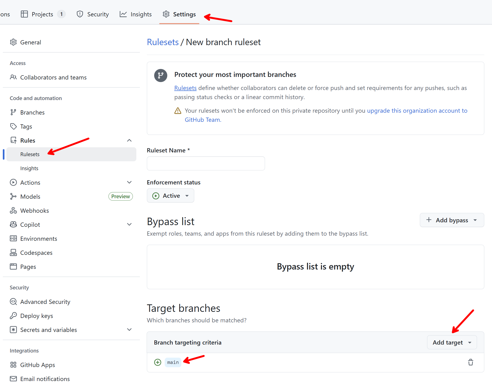
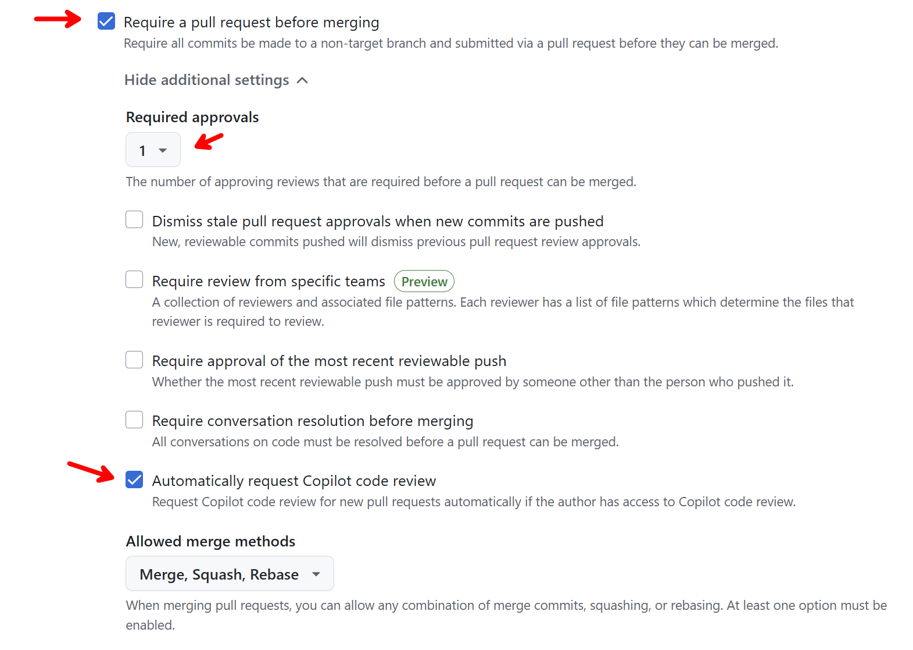
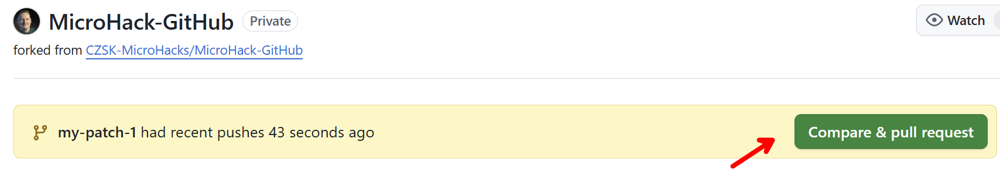
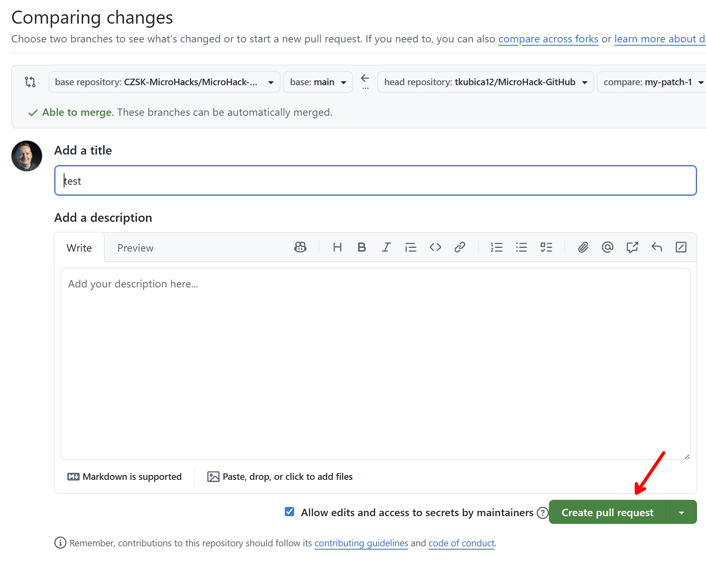
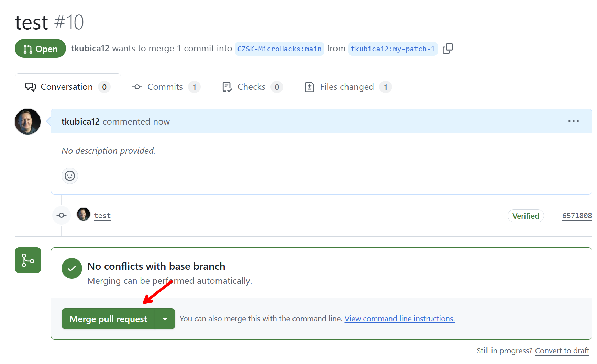
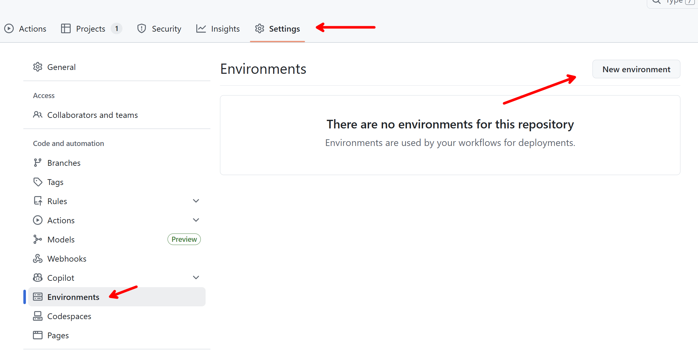
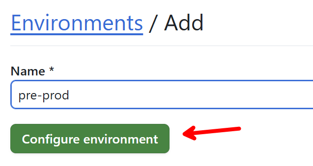
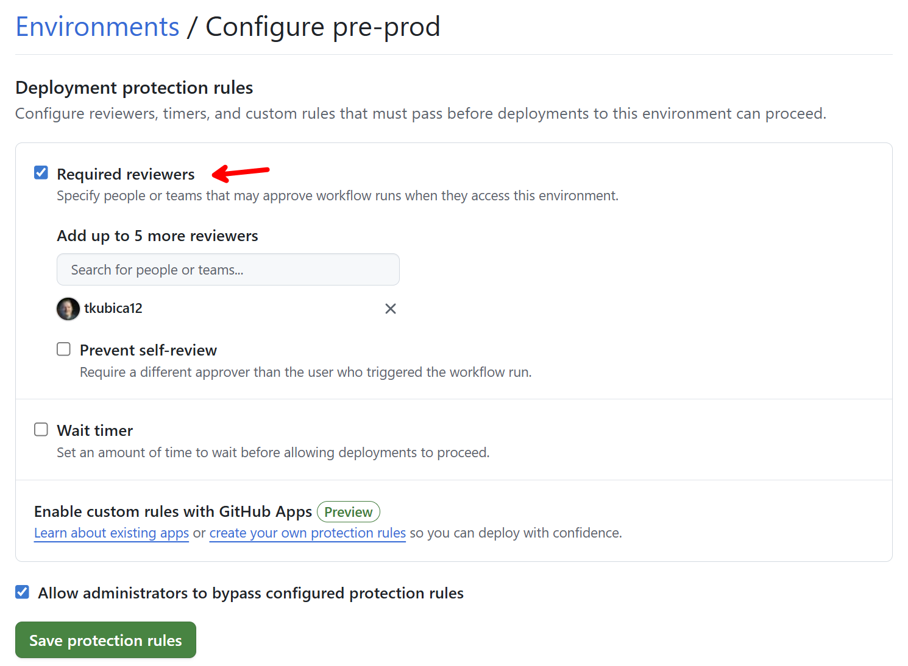

# Solution: Challenge 10

## Pull request
### Task 1: Enforce policies




### Task 2: Test Pull Request
1. In VS Code lower left corner click on `main` and `Create New Branch` called `my-patch-1`
2. Copy one of your `main.py` files to `main-delete-1.py` and commit
3. Create Pull Request, review it, merge it, close it, delete patch branch.







### Task 3: Add tests and automation
Create unit test, here is example Copilot prompt for doing that:

```markdown
Create very simple unit test in my accessory-service using pytest and try to run it. 
Iterate until everything pass, do not change code, we are writing test for existing code.
```

Create new workflow that triggers on Pull Request to main and run pytest.

```markdown
Create new GitHub workflow that will:
- Trigger on pull request to main when there is change in `backend/accessory-service`
- Run pytest in verbose mode
- If pass, actions should be green (ignore warnings)
```

Create another Pull Request, tests will trigger automatically.

[](./docs/pr04.png)

[](./docs/pr05.png)


### Task 4: Enable built-in GitHub Code Quality scanning
TBD

## Deployment environments
First on repository settings create environment. Note you can have different set of variables, secrets and Managed Identity federation. This allows for environments to be connecting to different subscription for example.







Enhance your accessory pipeline with

```markdown
Enhance my `accessory-service` workflow to create mock of addition step (just print something) after `build-and-deploy` and `post-deploy-tests` steps.
Call it `pre-prod-deploy` that will run in `pre-prod` environment.
```

## Optional: GitHub Code Security
