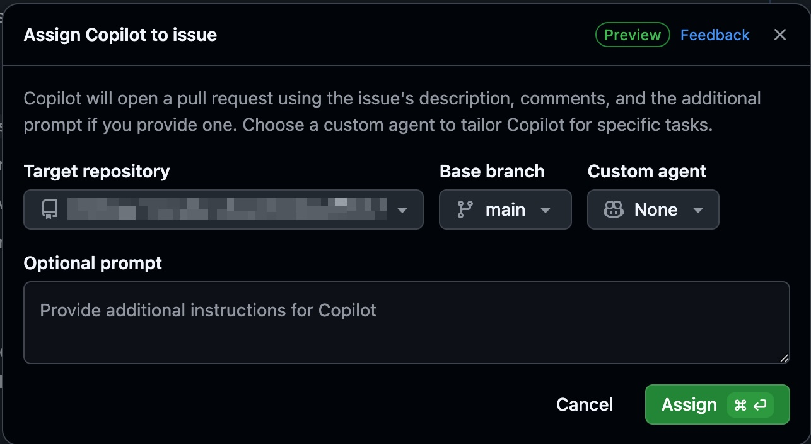
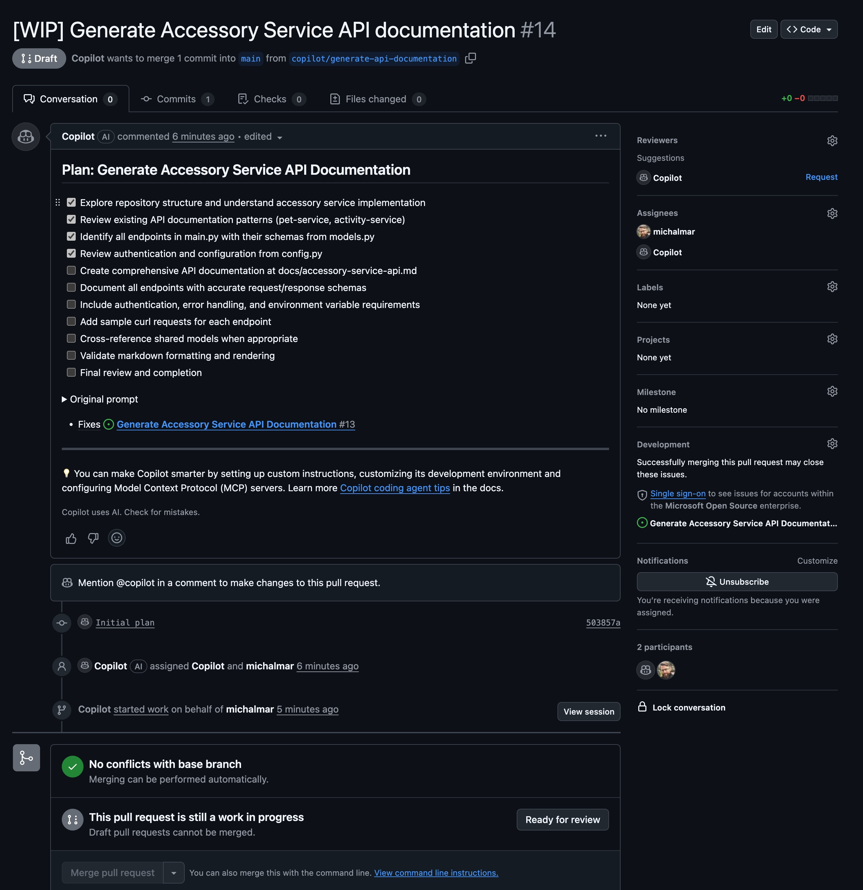

# Solution: Challenge 11

Task automation via GitHub Copilot Agents is powerful feature that can save time on routine documentation tasks. In this solution, we will walk through how to effectively create, assign, and manage a Copilot agent issue to generate accurate API documentation for the Accessory Service backend.

## Solution Approach

Create issue on your GitHub repository using the provided template.

### Agent Issue Prompt

Copy the template below into a new GitHub Issue and customize details such as branch names or links:

```markdown
## Task: Generate Accessory Service API Documentation

### Context
- Source code: `backend/accessory-service/main.py`, `models.py`, `config.py`.
- Existing references: check for prior docs in `backend/accessory-service/README.md`.
- Include authentication, error handling, and sample requests.

### Requirements
- Produce Markdown documentation for every public endpoint with method, path, purpose, and request/response schemas.
- Note required headers, auth tokens, and relevant environment variables.
- Provide at least one sample request/response pair per endpoint using curl or HTTP file syntax.
- Cross-reference shared models in other services when used.

### Acceptance Criteria
- [ ] Documentation stored at `docs/accessory-service-api.md` (create file if missing).
- [ ] All endpoints in `main.py` are represented with accurate schemas from `models.py`.
- [ ] Auth and configuration steps validated against `config.py`.
- [ ] Markdown passes linting and renders without warnings.

### Deliverables
- Pull request with the new or updated documentation file.
- Comment summarizing any ambiguities or assumptions.
```

## Sumit the issue and assign to Copilot Agent

You may customize the prompt further based on your specific codebase or documentation standards. 


## Check the progress

Monitor the issue status, provide clarifications if needed, and review the generated documentation once the agent completes the task.


## Merge the PR
Review the pull request created by the agent, suggest any necessary fixes, and approve it once everything aligns with the service implementation.

## View the Documentation

[Accessory Service API Documentation](./docs/accessory-service-api.md)

## Key Learning Points
- How to structure a clear and detailed GitHub Issue for Copilot agents.

## Next Steps
- Once the agent completes the issue, review the pull request, suggest fixes if required, and approve when everything matches the service implementation.