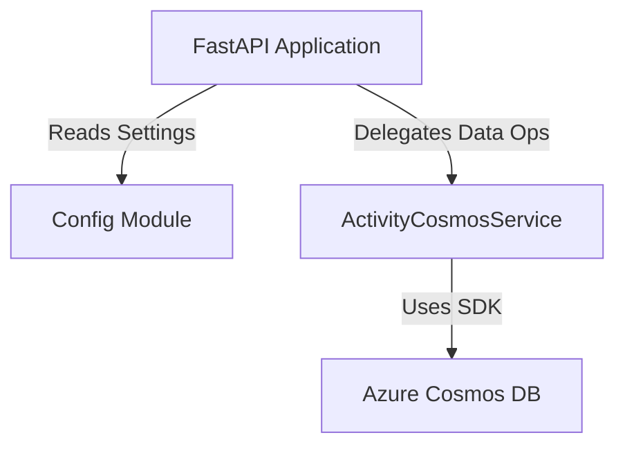

# Service Architecture Snapshot

Provide a focused view of how this service fits into the broader system while inheriting global context from `../../platform/ARCHITECTURE.md`.

## Context
The **Activity Service** manages the timeline of events for pets. It is a high-volume write service that allows logging various activity types (walks, feeds, etc.) and querying them with filters.

**Dependencies:**
-   **Upstream**: Frontend App (calls API).
-   **Downstream**: Azure Cosmos DB (stores data).

## Component Diagram

### Configuration Strategy
The service follows the same configuration pattern as the Pet Service:
1.  **Environment Variables**: Primary source of configuration.
2.  **Dotenv Support**: Loads `.env` files for local development.
3.  **Validation**: The `Settings` class ensures `COSMOS_ENDPOINT` is set.
4.  **Environment Detection**:
    -   **Local**: Detects `localhost` endpoint and expects `COSMOS_KEY`.
    -   **Azure**: Configured to use Managed Identity in production environments.

## Data Flow
1.  **Request**: HTTP Request hits FastAPI endpoint (e.g., `POST /api/activities`).
2.  **Validation**: Pydantic models (`ActivityCreate`) validate the payload.
3.  **Service Layer**: `ActivityCosmosService` handles business logic.
4.  **Persistence**: Data is written to the `activities` container in Cosmos DB.
5.  **Response**: JSON response with the created activity.

## Cross-Cutting Concerns

### Resilience
-   **Startup**: Uses `lifespan` context manager for clean startup/shutdown sequences.
-   **Lazy Connection**: The database client is initialized lazily to improve startup reliability.

### Performance
-   **Filtering**: Supports server-side filtering (via Cosmos DB queries) for `petId`, `type`, and date ranges to minimize data transfer.
-   **Pagination**: Implements `limit` and `offset` to handle large activity histories.

## Decision References
-   **Service-Specific ADR**: Separation of Activity Service from Pet Service to allow independent scaling, as activity logs are expected to grow significantly faster than pet profiles.
