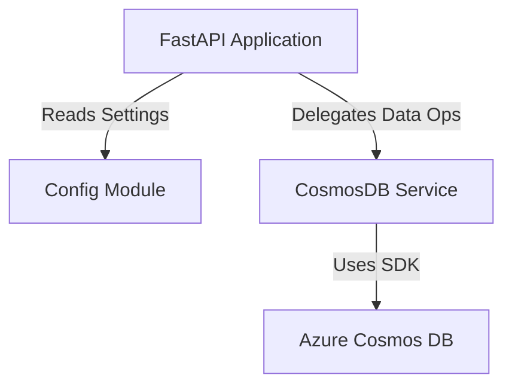

# Service Architecture Snapshot

Provide a focused view of how this service fits into the broader system while inheriting global context from `../../platform/ARCHITECTURE.md`.

## Context
The **Pet Service** is the authoritative source for pet profiles. It manages the lifecycle of pet entities (creation, updates, deletion) and provides search capabilities. It is designed to be a stateless microservice that delegates persistence to Azure Cosmos DB.

**Dependencies:**
-   **Upstream**: Frontend App (calls API).
-   **Downstream**: Azure Cosmos DB (stores data).

## Component Diagram

### Configuration Strategy
The service uses a centralized `config.py` module to manage settings:
1.  **Environment Variables**: Primary source of configuration.
2.  **Dotenv Support**: Loads `.env` files for local development convenience.
3.  **Validation**: The `Settings` class validates presence of critical keys (e.g., `COSMOS_ENDPOINT`).
4.  **Environment Detection**: Automatically detects if running against a local Emulator (localhost) or Azure.
    -   **Local**: Requires `COSMOS_KEY`.
    -   **Azure**: Uses Managed Identity (implied by absence of key requirement in production code paths, though currently code might support key-based auth for simplicity).

## Data Flow
1.  **Request**: HTTP Request hits FastAPI endpoint (e.g., `POST /api/pets`).
2.  **Validation**: Pydantic models (`PetCreate`) validate the payload structure and types.
3.  **Service Layer**: `CosmosDBService` constructs the item dictionary, generating IDs and timestamps.
4.  **Persistence**: The Azure Cosmos DB SDK executes the operation against the `pets` container.
5.  **Response**: The created/retrieved entity is returned as JSON.

## Cross-Cutting Concerns

### Resilience
-   **Database Connection**: Lazy initialization pattern in `lifespan` or on first request to ensure service startup doesn't crash immediately if DB is unreachable (though health checks will fail).
-   **Error Handling**: Global exception handlers convert DB errors into standardized HTTP 500/404 responses.

### Performance
-   **Async/Await**: The service utilizes Python's `asyncio` capabilities (where supported by the DB driver) to handle concurrent requests efficiently.
-   **Caching**: `lru_cache` is used for configuration settings to avoid repeated environment variable reads.

## Decision References
-   **Service-Specific ADR**: Use of Pydantic for dual purpose: API validation and internal data modeling.
